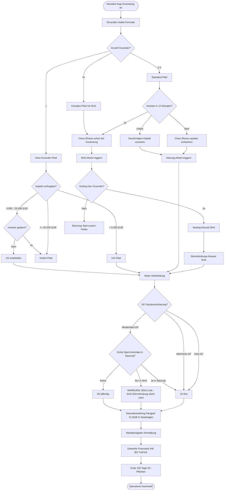
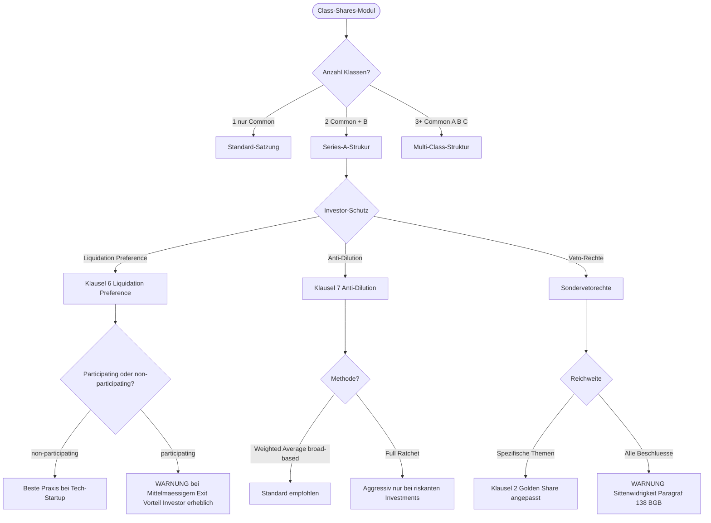
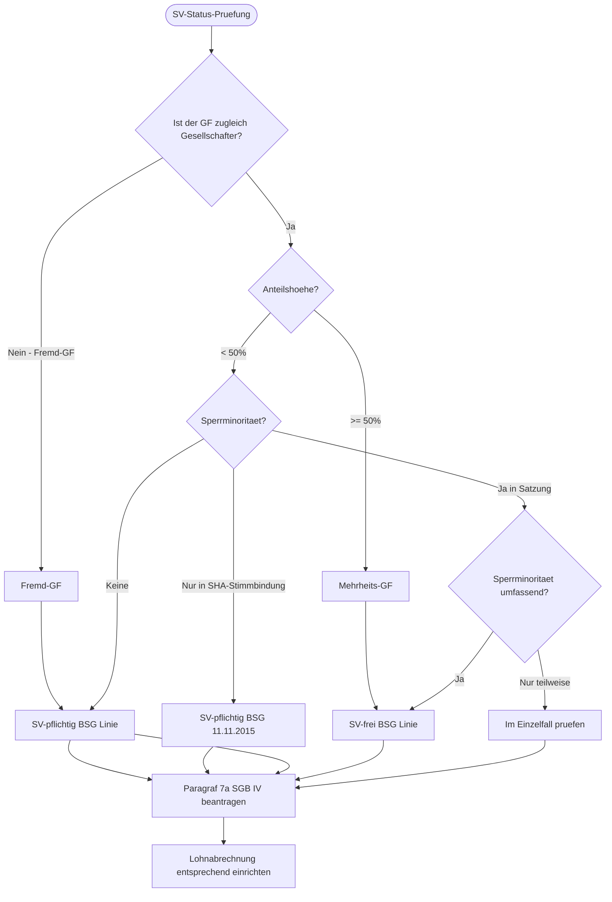
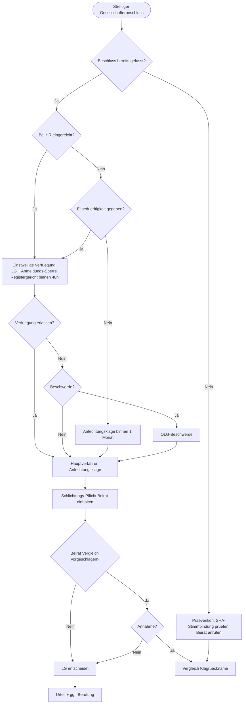

# Intake Decision Tree

## Zweck

Grafischer Decision Tree für den Gründer-Intake-Workflow. Zeigt die **conditional logic**: welche Folgefragen sich aus welcher Antwort ergeben, wann welche Skills getriggert werden, wann welche Pflichtdokumente erzeugt werden.

Implementiert in **Mermaid**-Notation (rendert in GitHub, GitLab, Notion, Obsidian, VSCode, BitBucket).

---

## 1) Gesamt-Workflow



---

## 2) Detail-Diagramm: Class-Shares-Modul



---

## 3) Detail-Diagramm: SV-Status-Prüfung



---

## 4) Detail-Diagramm: Streit-Eskalations-Pfad



---

## 5) Pflichtfeld-Knotenpunkte

### Knoten 1 — Stammdaten

**Pflichtfelder**:
- Anzahl Gründer
- Identität (Name, Geburtsdatum, Anschrift, Ausweis-Nummer)
- Familienstand (für § 1365 BGB-Prüfung)
- Minderjaehrigkeit (für §§ 1643, 1822 BGB)

**Validierung**:
- Personalausweis-Nummer-Prüfung
- Bei Minderjaehrigkeit: Trigger Familiengerichtsgenehmigung

### Knoten 2 — Anteilsverteilung

**Pflichtfelder**:
- Stammkapital absolut
- Anteilshöhen pro Gründer
- Klassen-Festlegung (Common / A / B / C)

**Validierung**:
- Summe = 100 %
- Mindesthöhen pro Klasse
- Pflicht-Hinweis: bei Investor-Roadmap Class-Shares vorsehen

### Knoten 3 — Firma und IP

**Pflichtfelder**:
- Wunsch-Firma
- Sitz
- Geschäftsgegenstand

**Validierung-Trigger**:
- HR-Suche bundesweit
- IHK-Vorprüfung
- DPMA / EUIPO-Recherche
- Domain-Verfügbarkeit
- Bei Kollision: Alternativ-Vorschläge anbieten

### Knoten 4 — Geschäftsführung

**Pflichtfelder**:
- Anzahl GF
- Gesellschafter oder Fremd-GF
- Anteilshöhe (falls Gesellschafter-GF)
- Anstellungsvertrag-Eckdaten

**Trigger**:
- SV-Status-Prüfung
- Statusfeststellung Paragraf 7a SGB IV
- Geschäftsführervertrag-Generierung

### Knoten 5 — SHA und Vesting

**Pflichtfelder bei Multi-Gründer**:
- Vesting-Periode (Standard 48 Monate)
- Cliff (Standard 12 Monate)
- Bad-Leaver-Definition
- Drag/Tag-Schwellen

### Knoten 6 — Beirat

**Optional, aber empfohlen**:
- Beirat ja/nein
- Anzahl Mitglieder
- Schlichtungs-Funktion ja/nein

### Knoten 7 — Notar

**Trigger**:
- DiRUG online oder physisch?
- Termin-Buchung
- Unterlagen-Liste generieren
- Stammkapital-Einzahlung vorbereiten

### Knoten 8 — Behörden-Pflichten

**Trigger automatisch nach HR-Eintragung**:
- Gewerbeanmeldung
- ELSTER-Fragebogen
- IHK
- BG (Frist 1 Woche)
- TraFinG (unverzueglich)

---

## 6) Trigger-Events für Fristen-Engine

| Event | Frist | Aktion |
|---|---|---|
| HR-Eintragung | + 1 Woche | BG-Anmeldung erinnern |
| HR-Eintragung | + 1 Monat | ELSTER-Fragebogen einreichen |
| HR-Eintragung | + sofort | TraFinG-Meldung |
| Geschäftsjahresende | + 3 Monate | Jahresabschluss aufstellen |
| Jahresabschluss | + 12 Monate | Bundesanzeiger-Veröffentlichung |
| GV-Beschluss Kapitalerhöhung | + 1 Monat | Anfechtungsfrist abgelaufen |
| Krisenfrüherkennung-Trigger | + sofort | StaRUG-Prüfung oder § 49 III GmbHG-Versammlung |
| Insolvenz-Reife | + 3 Wochen | § 15a InsO-Antragspflicht |

---

## 7) Workflow-Engine-Implementierung

### Empfohlene Plattformen

- **Bryter** (https://bryter.com) — No-Code Legal Workflow
- **Josef** (https://www.josef.legal) — Document Automation
- **Documate** (https://www.documate.org) — Doc-Assembly für Legal
- **Neota Logic** — Enterprise-Workflow
- **Custom**: Node.js + JSON Schema + React Hook Form

### Architektur

```
┌─────────────────────────────────────────┐
│  Frontend (React Hook Form)             │
│  Kaskadierende Fragen, JSON Schema       │
└────────────────┬────────────────────────┘
                 │
┌────────────────▼────────────────────────┐
│  Business-Logic-Engine                  │
│  Conditional Logic, Validierung,        │
│  Trigger-Events, Fristen                │
└────────────────┬────────────────────────┘
                 │
   ┌─────────────┼─────────────┐
   │             │             │
┌──▼──┐    ┌────▼─────┐  ┌────▼──────┐
│ DOC │    │ Fristen-  │  │ Notar-    │
│ ASM │    │ Engine    │  │ Paket-   │
│     │    │ iCal/Out- │  │ ZIP-      │
│     │    │ look      │  │ Export   │
└─────┘    └───────────┘  └───────────┘
```

### Output-Formate

- **DOCX** (Microsoft Word): Satzung, SHA, GF-Vertrag, Beiratsordnung
- **PDF** (signiertes Endprodukt): nach Notar-Beurkundung
- **XLSX** (Excel): Cap Table, Fristen-Liste, Behörden-Checkliste
- **iCal/ICS**: Fristen-Kalender für Outlook/Apple Calendar
- **JSON**: Daten-Export für Buchhaltung / CRM
- **ZIP**: Notar-Paket mit allen Urkunden

---

## 8) Validierungs-Regeln

### Hartes Validierungs-Block

- Stammkapital < Mindesthoehe -> Block
- Anteilssumme != 100 % -> Block
- Pflichtfeld nicht ausgefüllt -> Block
- Bei Sacheinlage: kein Werthaltigkeits-Nachweis -> Block
- Bei Minderjaehrigem: keine Familiengericht-Genehmigung -> Block

### Weiches Validierungs-Warnung

- Anteilsverteilung 50/50 ohne Stichentscheid -> Warnung Patt-Risiko
- Vesting fehlt bei Multi-Gründer -> Warnung Bad-Leaver-Risiko
- Bezugsrechtsausschluss bei kuenftiger KE geplant ohne sachliche Begründung -> Warnung Anfechtungs-Risiko
- Minderheits-Gesellschafter-GF ohne Sperrminorität -> Warnung SV-Pflicht
- Wettbewerbsverbot ohne Karenz -> Warnung Sittenwidrigkeit
- Marken-Konflikt erkannt -> Warnung mit Vorschlag-Alternativen

---

## 9) Reporting und Audit-Trail

### Audit-Trail

Jede Eingabe und jede Entscheidung im Workflow wird protokolliert mit:

- Zeitstempel
- Benutzer
- Eingabe-Wert
- Validierungs-Status
- Triggered Skills / Documents

### Reporting

Am Ende des Intakes wird automatisch generiert:

- **Datenblatt Gründung** (alle Eckdaten)
- **Cap Table** initial
- **Pflichten-Checkliste** mit Fristen
- **Stoppschilder-Liste** (was zwingend Anwalt / Notar / Steuerberater)
- **Notar-Paket** vorbereitet
- **Behörden-Pflichten-Kalender** als iCal

---

## 10) Beispielhafter Knoten-Inhalt JSON

```json
{
  "node_id": "intake_class_shares",
  "title": "Class-Shares-Festlegung",
  "question": "Sollen Anteilsklassen schon bei Gruendung eingefuehrt werden?",
  "type": "single-choice",
  "options": [
    {
      "id": "only_common",
      "label": "Nur Common Shares — Class-Shares spaeter einfuehren",
      "next": "intake_vesting",
      "trigger_skill": "gesellschaftsgruender-gesellschaftsvertrag-gmbh",
      "warning_if": [
        {
          "condition": "investor_planned_within_12_months == true",
          "message": "Bei absehbarem Investor empfohlen, schon jetzt Class-Shares vorzusehen oder genehmigtes Kapital fuer Class B"
        }
      ]
    },
    {
      "id": "common_and_b",
      "label": "Common + Class B (Vorbereitung Investor)",
      "next": "intake_b_share_terms",
      "trigger_skill": "gesellschaftsgruender-share-classes-a-b-c"
    },
    {
      "id": "multi_class",
      "label": "Multi-Class (Common + A + B + C)",
      "next": "intake_multi_class_governance",
      "trigger_skill": "gesellschaftsgruender-share-classes-a-b-c",
      "warning": "Multi-Class-Strukturen sind komplex und teuer beim Notar; nur bei klarer Investoren-Roadmap empfohlen"
    }
  ]
}
```

---

## 11) Anschluss

- `gesellschaftsgruender-gruender-intake` — Intake-Fragen im Detail
- `gesellschaftsgruender-cap-table` — Cap-Table-Generation
- `gesellschaftsgruender-klauselkatalog-bilingual` — Klauseln im Volltext
- `gesellschaftsgruender-kommandocenter` — Gesamt-Workflow
