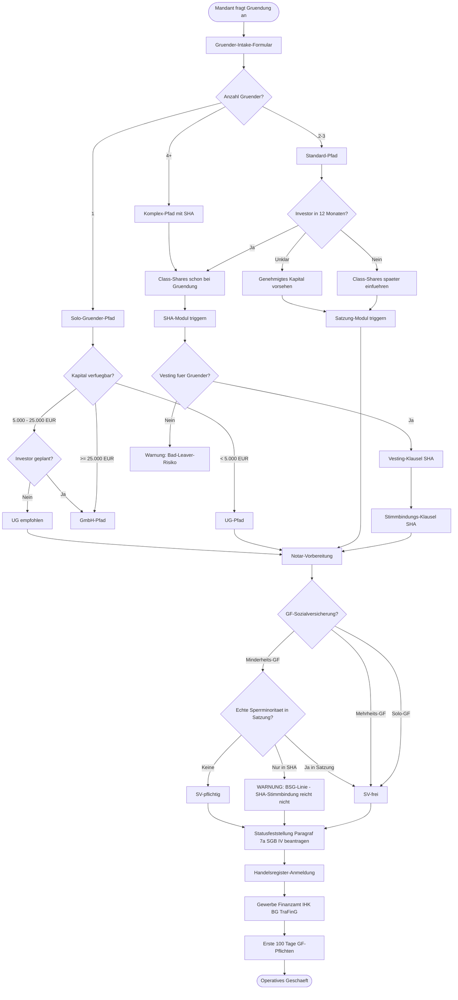
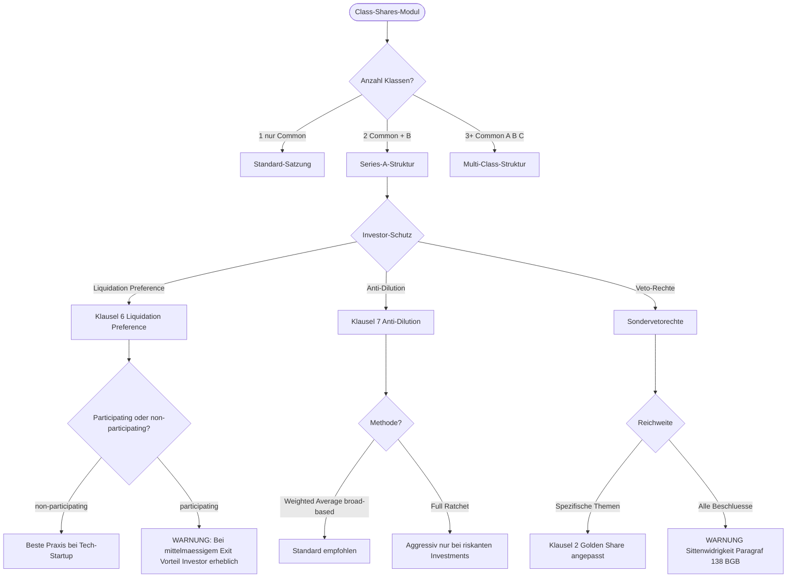
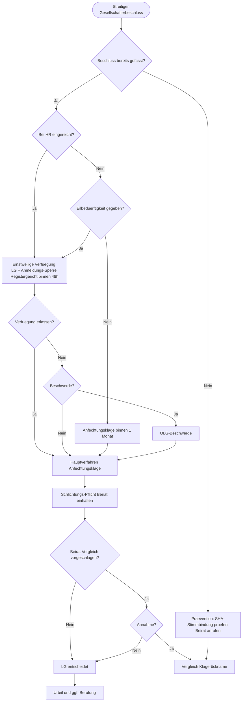

# Gesellschaftsgründer Intake Decision Tree, Gesellschaftsgründer Kg Und Gmbhcokg, Gesellschaftsgründer Mitarbeiterbeteiligung Esop Vsop, Gesellschaftsgründer Rechtsformwahl, Gesellschaftsgründer Share Classes A B C

## Arbeitsbereich

Dieser Arbeitsbereich führt die Teilfragen zu **Gesellschaftsgründer Intake Decision Tree, Gesellschaftsgründer Kg Und Gmbhcokg, Gesellschaftsgründer Mitarbeiterbeteiligung Esop Vsop, Gesellschaftsgründer Rechtsformwahl, Gesellschaftsgründer Share Classes A B C** in einem handhabbaren Prüfpfad zusammen. Beginne mit dem Modul, das die Akte wirklich trägt; kombiniere weitere Module nur, wenn Frist, Zuständigkeit, Beweislast oder Output dadurch konkret besser werden.

## Arbeitsmodule

| Arbeitsmodul | Fokus |
| --- | --- |
| `gesellschaftsgruender-intake-decision-tree` | Entscheidungsbaum für GmbH-Gründung: Rechtsformwahl, Gründungsweg, Kapitalausstattung. Normen: GmbHG, AktG, PartGG, HGB. Prüfraster: Haftung, Steuer, Kapital, Gesellschafteranzahl. Output: Entscheidungsmatrix Rechtsformwahl. Abgrenzung: nicht detaillierte Vertragsmuster. |
| `gesellschaftsgruender-kg-und-gmbhcokg` | KG und GmbH und Co. KG gründen: Gesellschaftsvertrag, Haftungsstruktur, steuerliche Transparenz. Normen: §§ 161 ff. HGB, GmbHG. Prüfraster: Komplementaer-GmbH, Kommanditistenstellung, steuerliche Behandlung. Output: KG-Gesellschaftsvertrag und GmbH-Komplementaer-Satzung. Abgrenzung: nicht reine GmbH-Gründung. |
| `gesellschaftsgruender-mitarbeiterbeteiligung-esop-vsop` | Prüft Mitarbeiterbeteiligung, virtuelle Anteile, Vesting, Leaver und Steuer-/Arbeitsrechtsschnittstellen. |
| `gesellschaftsgruender-rechtsformwahl` | Rechtsformwahl für Unternehmen: GmbH, UG, AG, GbR, PartG, KG, SE im Vergleich. Normen: GmbHG, AktG, PartGG, HGB, SE-VO. Prüfraster: Haftung, Steuern, Kapital, Mitbestimmung, Borsenreife. Output: Rechtsformvergleich-Matrix mit Empfehlung. Abgrenzung: nicht Gründungsunterlagen (separate Skills je Rechtsform). |
| `gesellschaftsgruender-share-classes-a-b-c` | Anteilsklassen A, B, C in GmbH oder AG gestalten: unterschiedliche Gewinn-, Stimm- und Liquidationsrechte. Normen: §§ 29 47 GmbHG, §§ 11 12 AktG. Prüfraster: Satzungsgestaltung, steuerliche Wirkung, Investorenerwartungen. Output: Satzungsklauseln Anteilsklassen. Abgrenzung: nicht Golden-Share-Einzelvetorecht. |

## Arbeitsweg

Für **Gesellschaftsgründer Intake Decision Tree, Gesellschaftsgründer Kg Und Gmbhcokg, Gesellschaftsgründer Mitarbeiterbeteiligung Esop Vsop, Gesellschaftsgründer Rechtsformwahl, Gesellschaftsgründer Share Classes A B C** zuerst das Arbeitsmodul wählen, dessen Tatsachen im konkreten Fall wirklich angelegt sind. Im Plugin `gesellschaftsgruender` bleiben Rollen, Fristen, Zuständigkeit, Anspruchs- oder Verfahrensgrundlage, Beweislast und gewünschter Output getrennt; Module nur kombinieren, wenn dieselbe Akte mehrere dieser Punkte trägt. Tragende Normen und Fundstellen nach `references/quellenhygiene.md` verifizieren.


## Arbeitsmodule im Detail

## 1. `gesellschaftsgruender-intake-decision-tree`

**Fokus:** Entscheidungsbaum für GmbH-Gründung: Rechtsformwahl, Gründungsweg, Kapitalausstattung. Normen: GmbHG, AktG, PartGG, HGB. Prüfraster: Haftung, Steuer, Kapital, Gesellschafteranzahl. Output: Entscheidungsmatrix Rechtsformwahl. Abgrenzung: nicht detaillierte Vertragsmuster.

# Intake Decision Tree

## Fachlicher Kern — Gesellschaftsrecht und Corporate Law
- **Problemfokus dieses Skills:** Bleibe beim konkreten Titel `Intake Decision Tree` und löse die dort angelegte Fachfrage; keine Flucht in allgemeines Routing, außer eine echte Frist oder Zuständigkeit ist unklar.
- **Normenradar:** GmbHG §§ 3, 5, 13, 15, 16, 30, 34, 35, 40, 43, 46, 47, 49 ff.; AktG §§ 76, 93, 111, 119, 130, 243 ff.; HGB §§ 105 ff., 161 ff.; MoPeG/GesRÄndG-Folgen; UmwG; FamFG/Registerrecht; GWB/Fusionskontrolle bei Transaktionen.
- **Verifizierte Anker:** BGH, Urteil vom 08.11.2022 - II ZR 91/21 (zutreffende Gesellschafterliste/Listenstreit); BGH, Beschluss vom 18.03.2025 - II ZB 11/24 (Registerordner/Gesellschafterliste, Prüfungsumfang); BGH, Urteil vom 11.12.2006 - II ZR 166/05 und Urteil vom 12.04.2016 - II ZR 275/14 (Treuepflicht, Zustimmungspflichten); BGH, Urteil vom 30.09.2025 - II ZR 154/23 (Drittvergleich/verdeckte Vermögenszuwendung, Organ-/Beschlusskontrolle).
- **Arbeitsmodus:** Erst Gesellschaftsform, Organ, Beschlussweg, Vertretung, Registerlage, wirtschaftliches Ziel und Minderheitenposition sortieren; dann Treuepflicht, Kapitalerhaltung, Haftung, Transaktions-Closing und Beweis-/Vollzugsrisiko prüfen.
- **Outputpflicht:** Beschluss-/Listenmatrix, Register-To-do, Board-/Beiratsvorlage, Closing-CP-Liste, Treuepflicht-Red-Team, Geschäftsführerhaftungsmemo oder Mandanten-Decision-Paper.
- **Fehlerbremse:** Tragende Normen/Entscheidungen live oder aus der Akte verifizieren; Rechtsprechung nur mit Gericht, Entscheidungsform, Datum, Aktenzeichen und frei prüfbarer Quelle. Keine BeckRS-, juris-, Kommentar- oder Aufsatz-Blindzitate aus Modellwissen.


## Kernsachverhalt

Der Gründer-Intake-Prozess ist das erste strukturierte Gespräch zwischen Mandant und Kanzlei. Zu diesem Zeitpunkt sind alle weichenstellenden Entscheidungen noch offen: Rechtsform, Kapitalstruktur, Gesellschafter-GF-Verhältnis, Investorenstruktur, Sozialversicherungsstatus. Fehlerhafte Weichenstellungen im Intake — falsche Rechtsform, fehlende Sperrminorität, nicht geplante Holding-Struktur — lassen sich später nur mit erheblichem Aufwand und steuerlichen Risiken korrigieren.

Dieser Skill stellt den grafischen Decision Tree für den Gründer-Intake-bereit: konditionale Logik als Mermaid-Diagramm, Pflichtfeld-Validierung, Trigger-Events für Skills und Dokumente, Fristen-Engine-Integration und Workflow-Engine-Hinweise für Implementierung in Bryter, Josef, Documate oder custom Node.js/React.

## Kaltstart-Rückfragen

1. **Mandats-Kontext:** Erstmaliges Intake oder Update eines bestehenden Mandats?
2. **Gründer-Profil:** Anzahl der Gründer, Identitätsdaten verfügbar?
3. **Kapital:** Eigenkapital verfügbar? Wie hoch?
4. **Investor-Roadmap:** Ist externer Investor in 12–24 Monaten geplant?
5. **GF-Rolle:** Soll ein Gründer Geschäftsführer werden? Anteilshöhe?
6. **Vorhandene Dokumente:** Liegt bereits ein Term Sheet, NDA oder LOI vor?
7. **Workflow-Engine:** In welcher Plattform soll der Decision Tree implementiert werden (Bryter, Josef, Documate, Custom)?
8. **Output-Format:** DOCX, PDF, XLSX, iCal/ICS oder JSON?

## Rechtlicher Rahmen

### Normtexte und Kernnormen

**§ 7a SGB IV — Statusfeststellungsverfahren**
> Die Einzugsstelle hat auf Antrag des Arbeitgebers oder der Arbeitnehmerin oder des Arbeitnehmers eine Entscheidung zu treffen, ob eine Beschäftigung vorliegt.

Das Statusfeststellungsverfahren bei der DRV Bund (Clearingstelle) ist das primäre Instrument zur verbindlichen Klärung des SV-Status eines Gesellschafter-GF. Es soll nach der BSG-Rechtsprechung frühzeitig — spätestens mit Aufnahme der GF-Tätigkeit — eingeleitet werden. Eine rückwirkende Beitragspflicht kann bis zu 4 Jahre zurückreichen (§ 25 SGB IV, Regelverjährung) oder bei vorsätzlicher Nichtanmeldung bis zu 30 Jahre (§ 25 Abs. 1 S. 2 SGB IV).

**§ 20 GwG — Transparenzregister (TraFinG)**
> Vereinigungen sind verpflichtet, die wirtschaftlich Berechtigten zu ermitteln, aktuell zu halten und an das Transparenzregister zu melden.

Frist: unverzüglich nach Eintragung der Gesellschaft im Handelsregister und unverzüglich bei jeder Änderung der Beteiligungsverhältnisse (2 Wochen). Bußgeld bei Verstoss: bis 1.000.000 EUR (§ 56 GwG).

**§ 192 SGB VII — Berufsgenossenschaft**
> Bei Aufnahme der unternehmerischen Tätigkeit muss die Anmeldung bei der zuständigen Berufsgenossenschaft innerhalb von 1 Woche erfolgen.

**§ 138 AO — Steuerliche Anzeigepflicht**
> Steuerpflichtige, die eine gewerbliche oder berufliche Tätigkeit aufnehmen, haben dies dem Finanzamt mitzuteilen (ELSTER-Fragebogen).

**§ 1365 BGB — Verfügungsbeschränkung bei Güterstand**
> Wenn der Gründer im gesetzlichen Güterstand (Zugewinngemeinschaft) lebt, bedarf die Verfügung über das gesamte Vermögen der Zustimmung des Ehegatten. Bei Einbringung des gesamten Vermögens in eine Gesellschaft: Prüfung des § 1365 BGB.

**§§ 1643, 1822 BGB — Genehmigung des Familiengerichts bei Minderjährigen**
> Bei Beteiligung minderjähriger Gesellschafter: Familiengericht muss der Eingehung der gesellschaftsrechtlichen Verbindlichkeiten zustimmen.

### Leitentscheidungen

| Gericht | Aktenzeichen | Fundstelle | Relevanz |
|---|---|---|---|
| Rechtsprechung live prüfen | Live-Verifikation erforderlich | - | keine Entscheidung aus Modellwissen zitieren; vor Ausgabe offizielle oder frei zugängliche Quelle mit Gericht, Datum, Aktenzeichen und Aussage protokollieren |

## Prüfschema: Intake-Knotenpunkte

| Schritt | Knotenpunkt | Prüfinhalt | Trigger / Output |
|---|---|---|---|
| 1 | Stammdaten-Knoten | Anzahl Gründer; Identität (Name, Geburtsdatum, Ausweis-Nummer); Familienstand (§ 1365 BGB); Minderjährigkeit (§§ 1643, 1822 BGB) | Validierung; Trigger: Familiengericht-Genehmigung bei Minderjährigen |
| 2 | Rechtsformwahl-Knoten | Kapital verfügbar, Investoren geplant, Haftungsrisiko, Freiberuf? | Trigger: gesellschaftsgruender-rechtsformwahl |
| 3 | Kapital-Knoten | < 25.000 EUR → UG; 25.000 EUR → GmbH; Sacheinlage → Differenzhaftungsprüfung (§ 9 GmbHG) | Validierung Stammkapital; Sachgründungsbericht |
| 4 | Class-Shares-Knoten | Investor in 12 Monaten? → Class-Shares sofort; Nein → später oder Genehmigtes Kapital vorsehen | Trigger: SHA-Modul / Satzungs-Modul |
| 5 | SHA-Modul | Vesting für Gründer? Stimmbindung? Liquidation Preference? | Trigger: gesellschaftsgruender-klauselkatalog-bilingual |
| 6 | SV-Status-Knoten | GF ist Gesellschafter < 50 %? Echte Sperrminorität in Satzung? | Trigger: Statusfeststellungsverfahren § 7a SGB IV; Warnung bei SHA-only-Stimmbindung |
| 7 | Notar-Knoten | DiRUG online oder physisch? Termin gebucht? Unterlagen vollständig? | Trigger: Notar-Paket-Generierung |
| 8 | Behörden-Knoten | Gewerbe, Finanzamt (ELSTER), IHK, BG, TraFinG | Trigger: Fristen-Engine; automatischer Behörden-Kalender |
| 9 | Compliance-Knoten | Erste-100-Tage-GF-Pflichten: § 315 HGB, § 325 HGB (erste Offenlegung), § 40 GmbHG (Gesellschafterliste), § 20 GwG (TraFinG) | Trigger: gesellschafts-compliance |
| 10 | Streit-Eskalations-Knoten | Streit zwischen Gründern? Beschluss angefochten? | Trigger: gesellschaftsgruender-gesellschafterstreit-eilantraege |

## Gesamt(Mermaid)



## Detail-Diagramm: Class-Shares-Modul



## Detail-Diagramm: SV-Status-Prüfung


## Detail-Diagramm: Streit-Eskalations-Pfad



## Pflichtfeld-Knotenpunkte (vollständig)

### Knoten 1 — Stammdaten

**Pflichtfelder:**
- Anzahl Gründer
- Identität: Name, Geburtsdatum, Anschrift, Personalausweis-Nummer (GwG-Identifizierung)
- Familienstand (§ 1365 BGB-Prüfung: Zustimmung des Ehegatten bei Verfügung über Gesamtvermögen)
- Minderjährigkeit (§§ 1643, 1822 BGB: Familiengericht-Genehmigung erforderlich)

**Validierung:**
- Personalausweis-Nummer syntaktisch korrekt
- Bei Minderjährigkeit: Trigger Familiengericht-Genehmigung
- GwG-Pflicht: Identifizierungsunterlagen (§ 10 GwG) vorhanden?

### Knoten 2 — Anteilsverteilung

**Pflichtfelder:**
- Stammkapital absolut (in EUR)
- Anteilshöhen pro Gründer (in EUR und %)
- Klassen-Festlegung (Common / A / B / C)

**Validierung:**
- Summe aller Anteile = 100 %
- Mindesthöhe pro Klasse
- Pflicht-Hinweis: Bei Investor-Roadmap → Class-Shares vorsehen
- 50/50-Split ohne Stichentscheid → Warnung Patt-Risiko

### Knoten 3 — Firma und IP

**Pflichtfelder:**
- Wunsch-Firma
- Sitz (Bundesland, Stadt)
- Geschäftsgegenstand (präzise, für HV-Beschluss tauglich)

**Validierungs-Trigger:**
- HR-Suche bundesweit (Namenskollision)
- IHK-Vorprüfung
- DPMA-/EUIPO-Markenrecherche
- Domain-Verfügbarkeit
- Bei Kollision: Alternativ-Vorschläge anbieten

### Knoten 4 — Geschäftsführung

**Pflichtfelder:**
- Anzahl GF
- Gesellschafter oder Fremd-GF?
- Anteilshöhe (falls Gesellschafter-GF) → SV-Status-Prüfung
- Anstellungsvertrag-Eckdaten: Grundgehalt, Tantieme, Urlaub, Wettbewerbsverbot

**Trigger:**
- SV-Status-Prüfung (Diagramm 3)
- Statusfeststellungsverfahren § 7a SGB IV
- GF-Anstellungsvertrag-Generierung

### Knoten 5 — SHA und Vesting

**Pflichtfelder bei Multi-Gründer (≥ 2):**
- Vesting-Periode (Standard: 48 Monate)
- Cliff (Standard: 12 Monate)
- Bad-Leaver-Definition (eigene Kündigung, Pflichtverletzung, Wettbewerbsverstoß)
- Good-Leaver-Definition (Tod, Erwerbsunfähigkeit, einvernehmliche Aufhebung)
- Drag/Tag-Schwellen (Standard: 75 % Drag; 50 % Tag)

**Warnungen:**
- Fehlendes Vesting bei Multi-Gründer → Bad-Leaver-Risiko
- Anti-Dilution Full Ratchet → aggressiv; nur bei sehr riskanten Investments

### Knoten 6 — Beirat (optional, empfohlen)

- Beirat ja/nein
- Anzahl Mitglieder (ungerade für Stichentscheid)
- Schlichtungs-Funktion (Voraussetzung für Schlichtungspflicht vor Klage)
- Vergütung (oft: Stundensatz oder jährliche Vergütung)

### Knoten 7 — Notar

**Trigger:**
- DiRUG online oder physisch?
- Notar-Termin-Buchung (Vorlauf 2–4 Wochen)
- Unterlagen-Liste generieren (Gesellschaftsvertrag, Personalausweise, Vollmachten bei ausländischen Beteiligten, Einzahlungsbeleg für Stammkapital)
- Stammkapital-Einzahlung vorbereiten (Konto eröffnen vor Beurkundung; Einzahlungsbeleg als Anlage zur HR-Anmeldung)

### Knoten 8 — Behörden-Pflichten nach HR-Eintragung

**Trigger automatisch:**
- Gewerbeanmeldung: unverzüglich (§ 14 GewO)
- ELSTER-Fragebogen: innerhalb 4 Wochen (§ 138 AO)
- IHK-Anmeldung
- Berufsgenossenschaft: 1 Woche (§ 192 SGB VII)
- TraFinG-Meldung (§ 20 GwG): unverzüglich nach HR-Eintragung

## Trigger-Events für Fristen-Engine

| Event | Frist | Aktion | Norm |
|---|---|---|---|
| HR-Eintragung | + sofort | TraFinG-Meldung | § 20 GwG |
| HR-Eintragung | + 1 Woche | BG-Anmeldung | § 192 SGB VII |
| HR-Eintragung | + 4 Wochen | ELSTER-Fragebogen | § 138 AO |
| GF-Aufnahme Tätigkeit | + sofort | Statusfeststellungsverfahren § 7a SGB IV | § 7a SGB IV |
| Geschäftsjahresende | + 3 Monate | Jahresabschluss aufstellen (§ 264 Abs. 1 HGB) | § 264 HGB |
| Jahresabschluss aufgestellt | + 9 Monate | Bundesanzeiger-Offenlegung (GmbH) | § 325 HGB |
| GV-Beschluss | + 1 Monat | Anfechtungsfrist | § 246 AktG analog |
| Krisenfrüherkennung-Trigger (§ 102 StaRUG) | + sofort | StaRUG-Prüfung oder § 49 Abs. 3 GmbHG-Gesellschafterversammlung | §§ 102, 49 StaRUG; § 49 Abs. 3 GmbHG |
| Insolvenzreife (§§ 17, 19 InsO) | + 3 Wochen | § 15a InsO-Antragspflicht | § 15a InsO |
| Gesellschafterwechsel | + sofort (HR) / + 2 Wochen (TraFinG) | Gesellschafterliste § 40 GmbHG + TraFinG-Meldung § 20 GwG | §§ 40 GmbHG, 20 GwG |

## Validierungsregeln

### Hartes Validierungsblock (Blocked-State)

| Validierung | Norm | Fehler |
|---|---|---|
| Stammkapital < Mindesthöhe (UG: 1 EUR; GmbH: 25.000 EUR) | § 5 Abs. 1, § 5a Abs. 1 GmbHG | Block: Gründung nicht möglich |
| Anteilssumme ≠ 100 % | § 5 GmbHG | Block: Kapitalstruktur inkonsistent |
| Pflichtfeld fehlt (Name, Geburtsdatum, Anschrift) | § 10 GwG; § 7 GmbHG | Block: HR-Anmeldung nicht möglich |
| Sacheinlage ohne Werthaltigkeitsnachweis | § 9 GmbHG | Block: Sachgründungsbericht erforderlich |
| Minderjähriger ohne Familiengericht-Genehmigung | §§ 1643, 1822 BGB | Block: Beurkundung unzulässig |

### Weiches Validierungswarnung (Warning-State)

| Warnung | Grund | Empfehlung |
|---|---|---|
| 50/50-Anteilsverteilung ohne Stichentscheid | Patt-Risiko bei jeder streitigen Abstimmung | Stichentscheid durch Beirat oder numerische Asymmetrie |
| Vesting fehlt bei Multi-Gründer | Bad-Leaver ohne Schutz: Gründer kann sofort aussteigen und Anteile behalten | Vesting-Klausel SHA dringend |
| Bezugsrechtsausschluss ohne sachliche Begründung | Anfechtungsrisiko (BGH Kali+Salz) | Sachliche Begründung dokumentieren |
| Minderheits-GF ohne Sperrminorität in Satzung | SV-Pflicht nach BSG-Linie | Sperrminorität in Satzung verankern; SHA-Stimmbindung allein reicht nicht |
| Wettbewerbsverbot ohne Karenzentschädigung | § 74c HGB analog; sittenwidrig wenn > 0 EUR ohne Karenz | Karenzentschädigung 50 % der Vergütung vereinbaren |
| Marken-Kollision erkannt | DPMA-Suche positiv | Alternativname vorschlagen; Abmahnungsrisiko |

## Workflow-Engine-Implementierung

### Empfohlene Plattformen

| Plattform | Eignung | Besonderheit |
|---|---|---|
| Bryter (https://bryter.com) | No-Code Legal Workflow; Kanzlei-Standard | Gut für komplexe Conditional Logic; Dokumenten-Ausgabe |
| Josef (https://www.josef.legal) | Document Automation; KMU-Kanzleien | Einfach für Dokumentengenerierung; begrenzte Workflow-Logik |
| Documate (https://www.documate.org) | Doc-Assembly für Legal | Fokus auf Dokumentengenerierung; gut mit DOCX-Vorlagen |
| Neota Logic | Enterprise-Workflow; große Kanzleien | Teuer; mächtig für komplexe Regelwerke |
| Custom Node.js + JSON Schema + React Hook Form | Maximale Flexibilität | Entwicklungsaufwand ca. 80–200 Stunden |

### Architektur

```
┌──────────────────────────────────────────┐
│ Frontend (React Hook Form / Bryter UI) │
│ Kaskadierende Fragen, JSON Schema │
└───────────────────┬──────────────────────┘
 │
┌───────────────────▼──────────────────────┐
│ Business-Logic-Engine │
│ Conditional Logic, Validierung, │
│ Trigger-Events, Fristen │
└───────────────────┬──────────────────────┘
 │
 ┌─────────────┼─────────────┐
 │ │ │
┌─────▼───┐ ┌─────▼────┐ ┌────▼──────┐
│ DOC │ │ Fristen- │ │ Notar- │
│ ASM │ │ Engine │ │ Paket- │
│ DOCX │ │ iCal / │ │ ZIP- │
│ PDF │ │ Outlook │ │ Export │
└─────────┘ └──────────┘ └───────────┘
```

### Output-Formate

| Format | Zweck | Norm / Empfänger |
|---|---|---|
| DOCX | Satzung, SHA, GF-Vertrag, Beiratsordnung (Entwurf) | Anwalt / Mandant zur Bearbeitung |
| PDF | Endversion nach Beurkundung | Archivierung; Behörden |
| XLSX | Cap Table, Fristen-Liste, Behörden-Checkliste | Mandant; Steuerberater |
| iCal / ICS | Fristen-Kalender | Outlook / Apple Calendar; automatische Erinnerungen |
| JSON | Daten-Export | Buchhaltungs-Software; CRM |
| ZIP | Notar-Paket | Notar; alle Urkunden komprimiert |

## Beispielhafter Knoten-Inhalt JSON

```json
{
 "node_id": "intake_class_shares",
 "title": "Class-Shares-Festlegung",
 "question": "Sollen Anteilsklassen schon bei Gruendung eingefuehrt werden?",
 "type": "single-choice",
 "options": [
 {
 "id": "only_common",
 "label": "Nur Common Shares",
 "next": "intake_vesting",
 "trigger_skill": "gesellschaftsgruender-gesellschaftsvertrag-gmbh",
 "warning_if": [
 {
 "condition": "investor_planned_within_12_months == true",
 "message": "Bei absehbarem Investor empfohlen, schon jetzt Class-Shares oder genehmigtes Kapital fuer Class B vorzusehen"
 }
 ]
 },
 {
 "id": "common_and_b",
 "label": "Common + Class B (Vorbereitung Investor)",
 "next": "intake_b_share_terms",
 "trigger_skill": "gesellschaftsgruender-share-classes-a-b-c"
 },
 {
 "id": "multi_class",
 "label": "Multi-Class (Common + A + B + C)",
 "next": "intake_multi_class_governance",
 "trigger_skill": "gesellschaftsgruender-share-classes-a-b-c",
 "warning": "Multi-Class-Strukturen sind komplex und teuer beim Notar; nur bei klarer Investoren-Roadmap empfohlen"
 }
 ]
}
```

## Reporting und Audit-Trail

### Audit-Trail

Jede Eingabe und jede Entscheidung wird protokolliert mit:
- Zeitstempel (ISO 8601)
- Benutzer
- Eingabe-Wert
- Validierungs-Status (OK / Warning / Block)
- Triggered Skills / Dokumente

### Automatisches Reporting am Intake-Ende

- **Datenblatt Gründung**: alle Eckdaten in strukturierter Form
- **Cap Table Initial**: Anteilsverteilung, Klassen, Ausgabepreise
- **Pflichten-Checkliste**: mit Fristen (iCal-Export)
- **Stoppschild-Liste**: was zwingend Anwalt / Notar / Steuerberater
- **Notar-Paket**: vorbereitet für Notartermin (ZIP)
- **Behörden-Pflichten-Kalender**: automatisch als ICS-Datei

## Streitwert und Kosten

| Workflow-Element | Kostenhinweis |
|---|---|
| Bryter-Lizenz | ca. 500–2.000 EUR/Monat je nach Nutzung |
| Juristische Übersetzung (bei bilingualen Dokumenten) | 500–4.000 EUR je nach Umfang |
| Custom-Entwicklung (Node.js + React) | 80–200 Stunden × Entwickler-Stundensatz |
| Notar-Gebühren GmbH-Gründung (25.000 EUR Stammkapital) | ca. 700–1.500 EUR |
| Anwaltliche Begleitung kompletter Gründungs-| ca. 3.000–10.000 EUR (Kanzlei-abhängig) |

## Strategische Empfehlung

| Situation | Empfehlung |
|---|---|
| Startup mit Investor-Roadmap | Vollständiger Intake-mit Class-Shares, SHA, Vesting; Notar-Paket parallel vorbereiten |
| Solo-Gründer ohne Investorenpläne | Vereinfachter Workflow: Rechtsformwahl + GmbH/UG-Gründung + Behörden-Checkliste |
| Kanzlei will digitalisieren | Bryter oder Josef als No-Code-Einstieg; Custom-Entwicklung für maximale Kontrolle |
| Mehrere Gründer, Streitpotenzial absehbar | Vollständige SHA mit Vesting, Drag/Tag, Schiedsklausel; Beirat mit Schlichtungsfunktion |

## Anschluss-Skills

- `gesellschaftsgruender-gruender-intake` — Intake-Fragen im Detail
- `gesellschaftsgruender-cap-table` — Cap-Table-Generierung
- `gesellschaftsgruender-klauselkatalog-bilingual` — Klauseln im Volltext
- `gesellschaftsgruender-rechtsformwahl` — Rechtsformempfehlung aus Intake-Daten
- `gesellschaftsgruender-gesellschafterstreit-eilantraege` — Streit-Eskalationspfad

## Quellen und Zitierweise

- § 7a SGB IV (Statusfeststellungsverfahren)
- § 25 SGB IV (Verjährung SV-Beiträge: 4 Jahre / 30 Jahre)
- § 20 GwG (Transparenzregister; Meldefrist 2 Wochen)
- § 192 SGB VII (BG-Anmeldung 1 Woche)
- § 138 AO (Steuerliche Anzeige)
- §§ 1365, 1643, 1822 BGB (Ehegattenzustimmung; Minderjährige)
- § 15a InsO (Insolvenzantragspflicht 3 Wochen)

Zitierweise nach `../../references/zitierweise.md`.

Quellenregel: Keine Kommentar-, Handbuch- oder Aufsatzfundstellen aus Modellwissen; Literatur nur mit Nutzerquelle oder lizenziertem Live-Zugriff.
- Rechtsprechung: keine Entscheidung aus Modellwissen zitieren; vor Ausgabe über offizielle oder frei zugängliche Quelle mit Gericht, Entscheidungsform, Datum, Aktenzeichen und tragender Aussage verifizieren.

## Aktuelle Rechtsprechung (Ergaenzung)

- Rechtsprechung: keine Entscheidung aus Modellwissen zitieren; vor Ausgabe über offizielle oder frei zugängliche Quelle mit Gericht, Entscheidungsform, Datum, Aktenzeichen und tragender Aussage verifizieren.

## Output-Template: Intake-Ergebnis-Zusammenfassung

**Adressat:** Mandant / Kanzleiakte — Tonfall verstaendlich-erklaerend

```
INTAKE-ERGEBNIS — [FIRMA] (geplant)
Datum: [DATUM] | Bearbeiter: [NAME]

EMPFOHLENE RECHTSFORM: [GmbH / UG / GmbH & Co. KG]
Begruendung: [KURZE BEGRUENDUNG AUS DECISION TREE]

GESELLSCHAFTER:
 [NAME 1]: [%] Anteile | Sperrminoritaet: [Ja/Nein] | GF: [Ja/Nein]
 [NAME 2]: [%] Anteile | Sperrminoritaet: [Ja/Nein] | GF: [Ja/Nein]

SV-STATUS GF(s):
 [NAME]: [SV-pflichtig / SV-frei (Mehrheit)] | Statusfeststellung empfohlen: [Ja/Nein]

NAECHSTE SCHRITTE:
 [ ] Firmenname pruefen (IHK-Vorpruefung)
 [ ] Notar-Termin vereinbaren (Vorlauf: 2-4 Wochen)
 [ ] Stammkapital einzahlen (mind. 12.500 EUR)
 [ ] Transparenzregister-Anmeldung (nach HR-Eintragung)
 [ ] Berufsgenossenschaft (1 Woche nach Geschaeftsbeginn)
 [ ] Finanzamt (ELSTER-Fragebogen; § 138 AO)
 [ ] SV-Statusfeststellung beantragen (DRV Bund)

FRISTEN-EXPORT: [iCal / Outlook generiert: JA / NEIN]
NOTAR-PAKET: [ZIP erstellt: JA / NEIN]
```

## 2. `gesellschaftsgruender-kg-und-gmbhcokg`

**Fokus:** KG und GmbH und Co. KG gründen: Gesellschaftsvertrag, Haftungsstruktur, steuerliche Transparenz. Normen: §§ 161 ff. HGB, GmbHG. Prüfraster: Komplementaer-GmbH, Kommanditistenstellung, steuerliche Behandlung. Output: KG-Gesellschaftsvertrag und GmbH-Komplementaer-Satzung. Abgrenzung: nicht reine GmbH-Gründung.

# KG und GmbH & Co. KG

## Fachlicher Kern — Gesellschaftsrecht und Corporate Law
- **Problemfokus dieses Skills:** Bleibe beim konkreten Titel `KG und GmbH & Co. KG` und löse die dort angelegte Fachfrage; keine Flucht in allgemeines Routing, außer eine echte Frist oder Zuständigkeit ist unklar.
- **Normenradar:** GmbHG §§ 3, 5, 13, 15, 16, 30, 34, 35, 40, 43, 46, 47, 49 ff.; AktG §§ 76, 93, 111, 119, 130, 243 ff.; HGB §§ 105 ff., 161 ff.; MoPeG/GesRÄndG-Folgen; UmwG; FamFG/Registerrecht; GWB/Fusionskontrolle bei Transaktionen.
- **Verifizierte Anker:** BGH, Urteil vom 08.11.2022 - II ZR 91/21 (zutreffende Gesellschafterliste/Listenstreit); BGH, Beschluss vom 18.03.2025 - II ZB 11/24 (Registerordner/Gesellschafterliste, Prüfungsumfang); BGH, Urteil vom 11.12.2006 - II ZR 166/05 und Urteil vom 12.04.2016 - II ZR 275/14 (Treuepflicht, Zustimmungspflichten); BGH, Urteil vom 30.09.2025 - II ZR 154/23 (Drittvergleich/verdeckte Vermögenszuwendung, Organ-/Beschlusskontrolle).
- **Arbeitsmodus:** Erst Gesellschaftsform, Organ, Beschlussweg, Vertretung, Registerlage, wirtschaftliches Ziel und Minderheitenposition sortieren; dann Treuepflicht, Kapitalerhaltung, Haftung, Transaktions-Closing und Beweis-/Vollzugsrisiko prüfen.
- **Outputpflicht:** Beschluss-/Listenmatrix, Register-To-do, Board-/Beiratsvorlage, Closing-CP-Liste, Treuepflicht-Red-Team, Geschäftsführerhaftungsmemo oder Mandanten-Decision-Paper.
- **Fehlerbremse:** Tragende Normen/Entscheidungen live oder aus der Akte verifizieren; Rechtsprechung nur mit Gericht, Entscheidungsform, Datum, Aktenzeichen und frei prüfbarer Quelle. Keine BeckRS-, juris-, Kommentar- oder Aufsatz-Blindzitate aus Modellwissen.


## Triage zu Beginn

Klaere vor Empfehlung KG oder GmbH & Co. KG:

1. **Steuerliche Transparenz gewuenscht?** Personengesellschaft: Gewinne direkt bei Gesellschaftern besteuert; GmbH: Koerperschaftsteuer.
2. **Haftungsbeschraenkung gewuenscht?** Reine KG: Komplementaer haftet unbeschraenkt; GmbH & Co. KG: Komplementaer-GmbH begrenzt die Haftung.
3. **Freiberuflertaetigkeit?** KG / GmbH & Co. KG erzielt Gewerbesteuer; fuer Freiberufler PartG mbB besser.
4. **Nachfolge oder Familienstruktur?** GmbH & Co. KG optimal fuer Uebergaben (steuerliche Vorteile § 6 Abs. 3 EStG).
5. **Nur 1 Gruender?** Ein-Personen GmbH & Co. KG moeglich; einfachere GmbH oft praktikabler.
6. **Zeitplan?** GmbH & Co. KG erfordert zuerst GmbH-Gruendung (4-8 Wochen) + KG-Eintragung (weitere 2-4 Wochen).

## Zentrale Normen

- **§§ 161 ff. HGB** — Kommanditgesellschaft; Grundstruktur; Rechte und Pflichten der Gesellschafter
- **§ 161 I HGB** — Komplementaer: unbeschraenkte persoenliche Haftung
- **§ 170 HGB** — Kommanditist: keine gesetzliche Vertretungsmacht
- **§ 171 I HGB** — Hafteinlage: Begrenzung der Kommanditisten-Aussenhaftung
- **§ 172 IV HGB** — Riickgewaehr einlagegelebter Betrage; Wiederaufleben Haftung
- **§ 19 II HGB** — Pflicht-Namenszusatz "GmbH & Co. KG"
- **§ 15 EStG** — Mitunternehmerschaft; Personengesellschaftsbesteuerung
- **§ 15a EStG** — Verlustverrechnung Kommanditist bis zur Hoehe der Hafteinlage

## Aktuelle Rechtsprechung

- Rechtsprechung: keine Entscheidung aus Modellwissen zitieren; vor Ausgabe über offizielle oder frei zugängliche Quelle mit Gericht, Entscheidungsform, Datum, Aktenzeichen und tragender Aussage verifizieren.

## Quellenregel

Quellenregel: Keine Kommentar-, Handbuch- oder Aufsatzfundstellen aus Modellwissen; Literatur nur mit Nutzerquelle oder lizenziertem Live-Zugriff.
## Prüfschema: GmbH & Co. KG vs. GmbH

| Merkmal | GmbH & Co. KG | GmbH |
|---|---|---|
| Haftung | Kommanditisten: Hafteinlage; GmbH: Gesellschaftsvermoegen | Gesellschaftsvermoegen |
| Besteuerung | Transparent (§ 15 EStG); Gewerbesteuer auf KG-Ebene | KSt + GewSt auf GmbH-Ebene |
| Gruendungsaufwand | Hoch: GmbH + KG | Mittel: GmbH |
| Freiberufler | Ungeeignet (gewerblich) | Moeglich |
| Nachfolge | Optimal (§ 6 Abs. 3 EStG) | Anteile abtretbar |
| Buchfuehrung | Doppelte Buchfuehrung; GmbH + KG-Abschluss | Doppelte Buchfuehrung |

## Schritt-fuer-Schritt-Workflow

1. **Entscheidung GmbH & Co. KG:** Steuerberater konsultieren; Vergleich GmbH vs. GmbH & Co. KG.
2. **Komplementaer-GmbH gruenden:** Standard-GmbH, Stammkapital 25.000 EUR; Gegenstand: Komplementaertaetigkeit.
3. **KG-Vertrag entwerfen:** Firma, Sitz, Gegenstand, Hafteinlagen, Gewinnverteilung, Geschaeftsfuehrung.
4. **KG-Anmeldung HR:** Alle Gesellschafter; notarielle Beglaubigung; Anmeldung an das HR-Gericht.
5. **Steuerliche Anmeldungen:** Finanzamt (Fragebogen § 138 AO); ELSTER; ggf. Gewerbeamt.
6. **Sonderbetriebsvermoegen pruefen:** Ueberlassung von Wirtschaftsgutern durch Kommanditisten dokumentieren.
7. **Gesellschafterliste KG:** Nicht beim HR wie bei GmbH; KG-Vertrag ist massgeblich.

## Output-Template: KG-Vertrag (Kernauszug)

**Adressat:** Gesellschaftsvertrag KG — Tonfall rechtspraezise

```
GESELLSCHAFTSVERTRAG der [FIRMA] GmbH & Co. KG

§ 1 Firma und Sitz
Die Gesellschaft fuehrt die Firma:
[FIRMA] GmbH & Co. KG
Sitz: [ORT]

§ 2 Gegenstand
[BESCHREIBUNG DES UNTERNEHMENSGEGENSTANDS]

§ 3 Gesellschafter
Komplementaerin: [FIRMA] Verwaltungs-GmbH, HRB [NR.]
 — ohne Vermoegensbeteiligung und Hafteinlage —
Kommanditisten:
 [NAME 1]: Hafteinlage [BETRAG] EUR
 [NAME 2]: Hafteinlage [BETRAG] EUR

§ 4 Geschaeftsfuehrung und Vertretung
Die Geschaeftsfuehrung und Vertretung obliegt der
Komplementaerin. Ihre Geschaeftsfuehrer sind
[GF-NAME], handlnd im Namen der Komplementaerin.

§ 5 Gewinnverteilung
(1) Komplementaerin: Haftungs-Verguetung [BETRAG] EUR
 jaehrlich, erstattet von der KG.
(2) Restgewinn: Kommanditisten im Verhaeltnis ihrer
 Kapitalanteile.
```

## Rote Schwellen

- Reihenfolge nicht beachtet: KG ohne bestehende Komplementaer-GmbH scheitert beim HR
- Firma ohne "GmbH & Co. KG"-Zusatz: irrefuehrend (§ 18 II HGB; Paragraf 19 II HGB)
- Rechtsprechung: keine Entscheidung aus Modellwissen zitieren; vor Ausgabe über offizielle oder frei zugängliche Quelle mit Gericht, Entscheidungsform, Datum, Aktenzeichen und tragender Aussage verifizieren.
- Sonderbetriebsvermoegen uebersehen: unerwartete Steuerpflicht fuer Kommanditisten

## Quellen und Vertiefung

- §§ 161, 170, 171, 172 HGB; § 19 II HGB; §§ 15, 15a EStG
- Rechtsprechung: keine Entscheidung aus Modellwissen zitieren; vor Ausgabe über offizielle oder frei zugängliche Quelle mit Gericht, Entscheidungsform, Datum, Aktenzeichen und tragender Aussage verifizieren.
- Quellenregel: Literatur nur mit Nutzerquelle oder lizenziertem Live-Zugriff; keine Kommentar-, Handbuch- oder Aufsatzfundstellen aus Modellwissen.

## Uebergabe an andere Skills

- `gesellschaftsgruender-gmbh-vorbereitung` — Komplementaer-GmbH gruenden
- `gesellschaftsgruender-gesellschaftsvertrag-gmbh` — Satzung Komplementaer-GmbH
- `gesellschaftsgruender-handelsregister-anmeldung` — KG-Eintragung
- `gesellschaftsgruender-transparenzregister` — wirtschaftlich Berechtigte der KG

## 3. `gesellschaftsgruender-mitarbeiterbeteiligung-esop-vsop`

**Fokus:** Prüft Mitarbeiterbeteiligung, virtuelle Anteile, Vesting, Leaver und Steuer-/Arbeitsrechtsschnittstellen.

# ESOP/VSOP Mitarbeiterbeteiligung

## Fachlicher Kern — Gesellschaftsrecht und Corporate Law
- **Problemfokus dieses Skills:** Bleibe beim konkreten Titel `ESOP/VSOP Mitarbeiterbeteiligung` und löse die dort angelegte Fachfrage; keine Flucht in allgemeines Routing, außer eine echte Frist oder Zuständigkeit ist unklar.
- **Normenradar:** GmbHG §§ 3, 5, 13, 15, 16, 30, 34, 35, 40, 43, 46, 47, 49 ff.; AktG §§ 76, 93, 111, 119, 130, 243 ff.; HGB §§ 105 ff., 161 ff.; MoPeG/GesRÄndG-Folgen; UmwG; FamFG/Registerrecht; GWB/Fusionskontrolle bei Transaktionen.
- **Verifizierte Anker:** BGH, Urteil vom 08.11.2022 - II ZR 91/21 (zutreffende Gesellschafterliste/Listenstreit); BGH, Beschluss vom 18.03.2025 - II ZB 11/24 (Registerordner/Gesellschafterliste, Prüfungsumfang); BGH, Urteil vom 11.12.2006 - II ZR 166/05 und Urteil vom 12.04.2016 - II ZR 275/14 (Treuepflicht, Zustimmungspflichten); BGH, Urteil vom 30.09.2025 - II ZR 154/23 (Drittvergleich/verdeckte Vermögenszuwendung, Organ-/Beschlusskontrolle).
- **Arbeitsmodus:** Erst Gesellschaftsform, Organ, Beschlussweg, Vertretung, Registerlage, wirtschaftliches Ziel und Minderheitenposition sortieren; dann Treuepflicht, Kapitalerhaltung, Haftung, Transaktions-Closing und Beweis-/Vollzugsrisiko prüfen.
- **Outputpflicht:** Beschluss-/Listenmatrix, Register-To-do, Board-/Beiratsvorlage, Closing-CP-Liste, Treuepflicht-Red-Team, Geschäftsführerhaftungsmemo oder Mandanten-Decision-Paper.
- **Fehlerbremse:** Tragende Normen/Entscheidungen live oder aus der Akte verifizieren; Rechtsprechung nur mit Gericht, Entscheidungsform, Datum, Aktenzeichen und frei prüfbarer Quelle. Keine BeckRS-, juris-, Kommentar- oder Aufsatz-Blindzitate aus Modellwissen.


## Sofortstart

1. Kläre Rolle, Ziel, Gegner, Frist, Dokumente und gewünschtes Arbeitsprodukt.
2. Zerlege den Fall in Tatsachen, Normen, Streitpunkte, Beweisfragen und methodische Wertungen.
3. Liefere zuerst eine Kurzantwort mit Risikoampel, danach den Prüfpfad.
4. Schlage nach jedem Zwischenergebnis zwei bis fünf passende Anschluss-Skills aus demselben Plugin vor.

## Arbeitsweise

Erzeuge Eckpunktepapier und Klauselrisiken.

## Rechts- und Quellenanker

Je nach Rechtsform live prüfen: GmbHG, HGB, BGB-Gesellschaftsrecht nach MoPeG, PartGG, GenG, AktG, GwG, GewO, AO/UStG/EStG sowie Register- und Notarvorgaben.

## Stoppschilder

- Keine Kommentar-, Aufsatz- oder BeckRS/Juris-Blindzitate.
- Tragende Gesetzesstände live gegen amtliche/frei zugängliche Quellen prüfen.
- Rechtsprechung nur mit Gericht, Datum, Aktenzeichen und überprüfbarer Quelle verwenden.
- Bei Unsicherheit die Annahme ausdrücklich markieren und eine Rückfrage oder Quellenprüfung auslösen.

## Output

- Gründerfreundliche Kurzantwort
- To-do-Liste mit Zuständigen
- Dokumenten- und Lückenliste
- Risikoampel
- passende Anschluss-Skills


## Vertiefter Gründer-Workflow

Arbeite nicht abstrakt, sondern wie eine Gründungsakte mit Notar, Registergericht, Bank, Steuerberater und operativem Start. Führe den Nutzer durch diese Entscheidungspunkte:

1. **Rechtsform und Phase:** Vorgründung, Gründung, Registereintragung, erste Verträge, Änderung, Krise oder Exit. Prüfe, ob GmbH/UG, eGbR, OHG/KG, PartG, Verein, Genossenschaft oder ausländische Struktur betroffen ist.
2. **Dokumente:** Satzung/Gesellschaftsvertrag, Gesellschafterliste, Geschäftsführerbeschluss, Handelsregisteranmeldung, Notarentwurf, Bank-/KYC-Unterlagen, steuerliche Erfassung, Gewerbeanmeldung und wirtschaftlich Berechtigte trennen.
3. **Risikoachsen:** Haftung vor Eintragung, Vertretungsmacht, Kapitalaufbringung, Sacheinlage, verdeckte Sacheinlage, Scheinselbstständigkeit, Erlaubnispflichten, Steuer- und Umsatzsteuerstart, IP-/Lizenzketten, Datenschutz und Geldwäsche.
4. **Praxisentscheidung:** Immer eine Gründeroption, eine konservative Anwaltsoption und eine schnelle Minimaloption darstellen. Bei Kosten-/Zeitkonflikten offen sagen, was schneller ist und welches Risiko bleibt.
5. **Anschlussarbeit:** Am Ende konkrete Folge-Skills aus `gesellschaftsgruender` nennen, etwa Satzung, Register, KYC, Steuerstart, Finanzierung, ESOP/VSOP, regulatorisches Geschäftsmodell oder Red-Team-Gründungspaket.

## Ergebnisqualität

- Liefere eine einseitige Gründer-Kurzfassung und danach eine anwaltliche Prüftabelle.
- Trenne Muss, Sollte, Optional und Später.
- Markiere externe Abhängigkeiten: Notar, Registergericht, Bank, Finanzamt, IHK/HWK, BaFin oder Fachbehörde.
- Keine endgültige Register- oder Steuerbehauptung ohne aktuellen Norm-/Formularcheck; bei Registerfragen die konkrete Zwischenverfügung oder den Notarentwurf als Primärquelle behandeln.

## 4. `gesellschaftsgruender-rechtsformwahl`

**Fokus:** Rechtsformwahl für Unternehmen: GmbH, UG, AG, GbR, PartG, KG, SE im Vergleich. Normen: GmbHG, AktG, PartGG, HGB, SE-VO. Prüfraster: Haftung, Steuern, Kapital, Mitbestimmung, Borsenreife. Output: Rechtsformvergleich-Matrix mit Empfehlung. Abgrenzung: nicht Gründungsunterlagen (separate Skills je Rechtsform).

# Rechtsformwahl

## Fachlicher Kern — Gesellschaftsrecht und Corporate Law
- **Problemfokus dieses Skills:** Bleibe beim konkreten Titel `Rechtsformwahl` und löse die dort angelegte Fachfrage; keine Flucht in allgemeines Routing, außer eine echte Frist oder Zuständigkeit ist unklar.
- **Normenradar:** GmbHG §§ 3, 5, 13, 15, 16, 30, 34, 35, 40, 43, 46, 47, 49 ff.; AktG §§ 76, 93, 111, 119, 130, 243 ff.; HGB §§ 105 ff., 161 ff.; MoPeG/GesRÄndG-Folgen; UmwG; FamFG/Registerrecht; GWB/Fusionskontrolle bei Transaktionen.
- **Verifizierte Anker:** BGH, Urteil vom 08.11.2022 - II ZR 91/21 (zutreffende Gesellschafterliste/Listenstreit); BGH, Beschluss vom 18.03.2025 - II ZB 11/24 (Registerordner/Gesellschafterliste, Prüfungsumfang); BGH, Urteil vom 11.12.2006 - II ZR 166/05 und Urteil vom 12.04.2016 - II ZR 275/14 (Treuepflicht, Zustimmungspflichten); BGH, Urteil vom 30.09.2025 - II ZR 154/23 (Drittvergleich/verdeckte Vermögenszuwendung, Organ-/Beschlusskontrolle).
- **Arbeitsmodus:** Erst Gesellschaftsform, Organ, Beschlussweg, Vertretung, Registerlage, wirtschaftliches Ziel und Minderheitenposition sortieren; dann Treuepflicht, Kapitalerhaltung, Haftung, Transaktions-Closing und Beweis-/Vollzugsrisiko prüfen.
- **Outputpflicht:** Beschluss-/Listenmatrix, Register-To-do, Board-/Beiratsvorlage, Closing-CP-Liste, Treuepflicht-Red-Team, Geschäftsführerhaftungsmemo oder Mandanten-Decision-Paper.
- **Fehlerbremse:** Tragende Normen/Entscheidungen live oder aus der Akte verifizieren; Rechtsprechung nur mit Gericht, Entscheidungsform, Datum, Aktenzeichen und frei prüfbarer Quelle. Keine BeckRS-, juris-, Kommentar- oder Aufsatz-Blindzitate aus Modellwissen.


## Kernsachverhalt

Die Wahl der Rechtsform ist die erste und folgenreichste Entscheidung bei der Unternehmensgründung. Sie bestimmt die persönliche Haftung der Gesellschafter, die steuerliche Behandlung von Gewinnen und Ausschüttungen, die Kosten und Komplexität der Gründung und des laufenden Betriebs, die Investorentauglichkeit, die Geschäftsführer-Sozialversicherungspflicht und die Möglichkeiten einer späteren Nachfolge oder eines Exits. Eine fehlerhafte Wahl kann nur durch Umwandlungsverfahren nach dem UmwG korrigiert werden — mit erheblichem Aufwand und steuerlichen Risiken (§§ 1 ff. UmwG; §§ 1 ff. UmwStG).

Dieser Skill unterstützt bei der systematischen Rechtsformwahl durch strukturierte Schlüsselfragen, eine vollständige Vergleichsmatrix und rechtsformbezogene Praxisempfehlungen.

## Kaltstart-Rückfragen

Vor der Rechtsformempfehlung sind folgende Angaben erforderlich:

1. **Anzahl Gründer und Beteiligungsverhältnisse:** Einzelgründer oder Mehrere? Geplante Aufteilung der Anteile?
2. **Kapital:** Wieviel Eigenkapital steht zur Gründung zur Verfügung? (Entscheidend für UG vs. GmbH: 25.000 EUR Schwelle)
3. **Haftungsrisiken:** Besteht ein erhebliches Haftungsrisiko aus dem Geschäftsbetrieb (Produkthaftung, Beratungshaftung, Bauleistungen)? Soll persönliche Haftung ausgeschlossen werden?
4. **Investoren:** Ist innerhalb von 3–5 Jahren die Aufnahme externer Investoren geplant? (Prägend für die Wahl zwischen GmbH, AG, UG)
5. **Steuerliche Situation:** Soll die Gesellschaft thesaurieren (Kapitalgesellschaftsbesteuerung vorteilhaft) oder sollen Gewinne laufend ausgeschüttet werden (Personengesellschaft ggf. vorteilhaft)?
6. **Branche / Berufsrecht:** Freier Beruf (Anwalt, Arzt, Steuerberater, Architekt → PartG/PartG mbB)? Gemeinnützige Tätigkeit (→ gGmbH)? Immobiliengeschäfte (→ eGbR vs. GbR durch MoPeG 2024)?
7. **Geschäftsführer-Sozialversicherung:** Soll der Gründer selbst Geschäftsführer werden? Welche Anteilsquote? (Relevant für SV-Status nach BSG-Linie)
8. **Holding-Struktur:** Plant ein Gründer, seine Anteile über eine persönliche Holding-GmbH zu halten (steuerlicher Vorteil nach § 8b KStG bei Anteilsveräußerung)?
- **Was will der Mandant wirklich erreichen?** (Nicht: was steht im Standardweg, sondern: welches Ergebnis ist fuer den Mandanten persoenlich/wirtschaftlich das beste? Manchmal ist der schnellere Vergleich besser als der formal "richtige" Weg.)

## Rechtlicher Rahmen

### Normtexte und Kernnormen

**GmbH — Mindestkapital und Gründung:**
> § 5 Abs. 1 GmbHG: Das Stammkapital der Gesellschaft muss mindestens 25.000 Euro betragen.
> § 5 Abs. 2 GmbHG: Jeder Gesellschafter hat auf das Stammkapital eine Stammeinlage zu leisten.

Bei Bargründung mit Musterprotokoll (§ 2 Abs. 1a GmbHG): vereinfachte Gründung mit maximal 3 Gesellschaftern und einem Geschäftsführer. Einzahlung: mind. die Hälfte des Stammkapitals vor Handelsregisteranmeldung (§ 7 Abs. 2 GmbHG).

**UG (haftungsbeschränkt) — Thesaurierungspflicht:**
> § 5a Abs. 3 GmbHG: In der Bilanz des nach dem Inkrafttreten dieser Vorschrift beginnenden Geschäftsjahres ist in der Bilanz eine gesetzliche Rücklage zu bilden, in die ein Viertel des um einen Verlustvortrag aus dem Vorjahr geminderten Jahresüberschusses einzustellen ist.

Die Thesaurierungspflicht gilt bis zur Erreichung von 25.000 EUR Stammkapital; dann Umfirmierung zur GmbH möglich.

**GbR / eGbR nach MoPeG 2024:**
> § 707b Abs. 1 BGB (n.F., in Kraft seit 01.01.2024): Eine nicht eingetragene Gesellschaft (GbR) kann keine Immobilien erwerben oder im Grundbuch eingetragen werden. Sie muss sich als eGbR im Gesellschaftsregister eintragen lassen.

Das Gesetz zur Modernisierung des Personengesellschaftsrechts (MoPeG) vom 10.08.2021 (BGBl. I 3436) ist seit 01.01.2024 in Kraft. Wesentliche Änderungen: Eintragungsmöglichkeit der GbR als eGbR, Abschaffung der Gesamthand zugunsten des Verbandsvermögens, Klarstellung zur Rechtsfähigkeit der GbR (§ 705 BGB n.F.).

**AG — Mindestkapital und Organstruktur:**
> § 7 AktG: Das Grundkapital muss mindestens 50.000 EUR betragen.
> §§ 76, 95, 118 AktG: Dreigliedrige Organstruktur: Vorstand (Geschäftsführung), Aufsichtsrat (Überwachung), Hauptversammlung (Beschlussfassung der Aktionäre).

**PartG mbB — Berufshaftpflicht:**
> § 8 Abs. 4 PartGG: Macht ein Partner bei der Berufsausübung einen Fehler, so haftet neben dem Partner nur das Gesellschaftsvermögen der Partnerschaft, wenn die Partnerschaft für Schäden aus Fehlern bei der Berufsausübung eine zu diesem Zweck unterhaltene Berufshaftpflichtversicherung unterhält.

**Sozialversicherungspflicht Gesellschafter-Geschäftsführer:**
> Rechtsprechung: keine Entscheidung aus Modellwissen zitieren; vor Ausgabe über offizielle oder frei zugängliche Quelle mit Gericht, Entscheidungsform, Datum, Aktenzeichen und tragender Aussage verifizieren.

**Holding-Struktur und § 8b KStG:**
> § 8b Abs. 2 KStG: Gewinne aus der Veräußerung von Anteilen an Kapitalgesellschaften sind bei einer körperschaftsteuerpflichtigen Holding-GmbH zu 95 % steuerfrei.

Wenn ein Gründer seine Anteile über eine Holding-GmbH hält, werden Veräußerungsgewinne nach § 8b KStG fast steuerfrei vereinnahmt. Planung der Holding-Struktur muss zwingend **vor** Gründung der operativen Gesellschaft erfolgen.

### Leitentscheidungen

| Gericht | Aktenzeichen | Fundstelle | Relevanz |
|---|---|---|---|
| Rechtsprechung live prüfen | Live-Verifikation erforderlich | - | keine Entscheidung aus Modellwissen zitieren; vor Ausgabe offizielle oder frei zugängliche Quelle mit Gericht, Datum, Aktenzeichen und Aussage protokollieren |

## Prüfschema: Rechtsformwahl

**Vorab:** Der untenstehende ist die typische Standardlinie. Wenn die Mandantenlage abweicht (siehe "Strategische Optionen" oben), sind die Schritte entsprechend zu verkuerzen, umzustellen oder durch ein anderes Skill zu ersetzen — der ist Leitfaden, nicht Pflichtprogramm.

| Schritt | Prüfungspunkt | Inhalt | Ergebnis |
|---|---|---|---|
| 1 | Gründerzahl | Einzelgründer oder Mehrere? | eK/UG (solo) oder GbR/GmbH/KG (mehrere) |
| 2 | Haftungsschutz | Erhebliches Haftungsrisiko? Persönliche Haftung vermeiden? | Bei Ja: Kapitalgesellschaft (UG, GmbH, AG) oder PartG mbB |
| 3 | Mindestkapital | Steht 25.000 EUR für GmbH zur Verfügung? | Nein → UG als Zwischenform; Ja → GmbH |
| 4 | Investorenfähigkeit | Externe Investoren geplant (VC, PE, Business Angel)? | Ja → GmbH mit Class-Shares oder AG; Nein → UG oder GmbH einfach |
| 5 | Steuerpräferenz | Thesaurierung oder laufende Ausschüttung? | Thesaurierung → Kapitalgesellschaft (KSt 15 %; Gewerbe); Ausschüttung → Personengesellschaft oder Kapitalgesellschaft mit Ausschüttungsplanung |
| 6 | Berufsrecht | Freier Beruf (§ 1 Abs. 2 PartGG)? | Ja → PartG oder PartG mbB (obligatorisch für Berufsgesellschaft von Anwälten/Ärzten) |
| 7 | Gemeinnützigkeit | Gemeinnütziger Zweck (§§ 52 ff. AO)? | Ja → gGmbH oder eingetragener Verein |
| Rechtsprechung live prüfen | Live-Verifikation erforderlich | Live-Verifikation erforderlich | keine Entscheidung aus Modellwissen; Quelle vor Ausgabe protokollieren |
| 9 | Holding-Planung | Gründer möchte Anteile über Holding halten? | Holding vor operativer GmbH gründen; nachträgliche Einbringung steuerlich komplex |
| 10 | MoPeG / eGbR | GbR soll Immobilien erwerben oder im Grundbuch eingetragen werden? | Eintragung als eGbR im Gesellschaftsregister erforderlich (§ 707b BGB) |
| 11 | Umwandlungskosten | Bestehende Rechtsform soll gewechselt werden? | Umwandlung nach UmwG (Verschmelzung, Spaltung, Formwechsel); Steuereffekte nach UmwStG analysieren |
| 12 | Geschäftsjahresende | Abweichendes GJ-Ende sinnvoll (z.B. 31.3. statt 31.12.)? | Steuerberater einbinden; Jahresabschluss-Frist und Steuerpflichten anpassen |
| 13 | Mitbestimmung | Mehr als 500 Arbeitnehmer geplant? | Drittelbeteiligung (§ 1 DrittelbG); ab 2.000 Arbeitnehmer: Mitbestimmung (§ 1 MitbestG) |
| 14 | Sacheinlagen | Sollen Sachwerte (IP, Maschinen, Grundstücke) eingebracht werden? | Differenzhaftung (§ 9 GmbHG); Sachgründungsbericht; steuerliche Bewertung erforderlich |

## Beweislast

| Frage | Beweislast | Erläuterung |
|---|---|---|
| Haftung eines GbR-Gesellschafters für Gesellschaftsschulden | Gläubiger (Nachweis der Gesellschaftsschuld) | GbR: akzessorische Haftung aller Gesellschafter nach § 721 BGB (n.F.) |
| Differenzhaftung UG / GmbH (§ 9 GmbHG) | Gesellschaft / Insolvenzverwalter | Nachweis, dass Sacheinlage bei Einbringung nicht werthaltig war |
| Thesaurierungspflicht UG erfüllt (§ 5a Abs. 3 GmbHG) | Geschäftsführer (Jahresabschluss als Nachweis) | Pflicht dokumentiert in Jahresabschluss und Gesellschafterbeschluss |
| SV-Freiheit des Gesellschafter-GF | Gesellschaft / GF im Statusfeststellungsverfahren | Nachweis durch Satzung (echte Sperrminorität); Statusfeststellungsverfahren § 7a SGB IV |
| Gemeinnützigkeit (§§ 52 ff. AO) | Gesellschaft gegenüber Finanzamt | Vorläufige Bescheinigung / Freistellungsbescheid als Nachweis |

## Fristen und Verjährung

| Ereignis | Frist | Norm | Folge bei Versäumnis |
|---|---|---|---|
| Handelsregisteranmeldung nach Gründung | Unverzüglich nach Beurkundung | § 7 GmbHG | Gesellschaft ist Vor-GmbH mit unbeschränkter Haftung der Gesellschafter (§ 11 Abs. 2 GmbHG) |
| Einzahlung Stammkapital | Vor HR-Anmeldung: mind. 50 % | § 7 Abs. 2 GmbHG | HR-Eintragung verweigert |
| Steuerliche Anmeldung beim Finanzamt | Innerhalb 4 Wochen nach Gründung | §§ 138 ff. AO | Verspätete Steuerfestsetzung; Fristverlängerung möglich |
| Gewerbeanmeldung | Vor Aufnahme des Gewerbebetriebs | § 14 GewO | Bußgeld; ggf. Untersagung |
| BG-Anmeldung | 1 Woche nach Aufnahme des Betriebs | § 192 SGB VII | Säumniszuschlag; rückwirkende Beitragspflicht |
| TraFinG-Meldung (Transparenzregister) | Unverzüglich nach Gründung und bei Änderungen | § 20 GwG | Bußgeld bis 1.000.000 EUR (§ 56 GwG) |
| UmwG-Verschmelzung: Spruchverfahren | 3 Monate ab Eintragung | § 4 SpruchG | Ausschlussfrist für Antragstellung |
| Verjährung GbR-Gesellschafterhaftung | 3 Jahre (§§ 195, 199 BGB) | allg. Verjährungsrecht | Haftung der Gesellschafter verjährt |

## Typische Gegenargumente und Fallen

| Einwand / Falle | Begründung / Fehlannahme | Richtige Einordnung |
|---|---|---|
| UG ist die günstigere GmbH | UG hat keine Investoren-Sperrwirkung | UG ist für Startups mit Investorenplan ungeeignet; Umwandlung zur GmbH kostet Zeit und Notargebühren; sofort GmbH bei Investor-Roadmap |
| GbR für Immobilien reicht | Vor MoPeG 2024 richtig | Seit 01.01.2024: GbR ohne Eintragung kann nicht im Grundbuch eingetragen werden (§ 707b BGB); eGbR zwingend |
| Rechtsprechung live prüfen | Live-Verifikation erforderlich | keine Entscheidung aus Modellwissen zitieren; vor Ausgabe offizielle oder frei zugängliche Quelle mit Gericht, Datum, Aktenzeichen und Aussage protokollieren |
| SHA-Stimmbindung reicht für SV-Freiheit | Kostengünstiger als Satzungsänderung | SHA-Bindung ist SV-rechtlich irrelevant; Sperrminorität muss zwingend in Satzung stehen (BSG-Linie) |
| Holding-GmbH nachträglich einfach einzufügen | Steuerlich problemlos | Nachträgliche Einbringung der Anteile in eine Holding-GmbH löst steuerpflichtige Veräußerung aus (§ 17 EStG); Holding muss vor operativer GmbH bestehen |
| eK ausreichend für kleine Dienstleister | Persönliche Haftung unbeschränkt | Bei Beratungsfehlern, Mietverträgen, Personalkosten: persönliche Haftung kann existenzbedrohend sein; UG mit 1.000 EUR oft sinnvoller |
| Gesellschaft hat sofort Rechtspersönlichkeit nach Beurkundung | Vor-GmbH-Stadium bis HR-Eintragung | Bis zur Eintragung: Gesellschafter haften persönlich für Verbindlichkeiten der Vor-GmbH (§ 11 Abs. 2 GmbHG) |

## Hauptrechtsformen im Vergleich

### Einzelkaufmann (eK)

| Merkmal | Inhalt |
|---|---|
| Haftung | Persönlich, unbeschränkt mit gesamtem Privatvermögen |
| Mindestkapital | Keines |
| Notarpflicht | Nein |
| Buchführung | Bis Schwellen (800.000 EUR Umsatz / 80.000 EUR Gewinn): EÜR; darüber: doppelte Buchführung (§§ 238 ff. HGB) |
| Steuer | Einkommensteuer; Gewerbesteuer-Freibetrag 24.500 EUR (§ 11 Abs. 1 S. 3 GewStG) |
| Geeignet für | Solo-Dienstleister mit überschaubarem Risiko, kein Fremdhaftungsrisiko |

### Gesellschaft bürgerlichen Rechts (GbR / eGbR nach MoPeG 2024)

| Merkmal | Inhalt |
|---|---|
| Haftung | Persönlich, unbeschränkt, gesamtschuldnerisch (§ 721 BGB n.F.) |
| Mindestkapital | Keines |
| MoPeG-Pflicht | Für Immobiliengeschäfte und Grundbucheintragung: Eintragung als eGbR zwingend (§ 707b BGB) |
| Buchführung | EÜR bis Schwellen; doppelte Buchführung bei Handelsgewerbe |
| Steuer | Mitunternehmerbesteuerung: Gewinne werden bei den Gesellschaftern nach ESt besteuert |
| Geeignet für | Freie Berufe (wenn PartG nicht passt), kleinste Personengesellschaften |

### GmbH

| Merkmal | Inhalt |
|---|---|
| Haftung | Beschränkt auf Gesellschaftsvermögen (§ 13 Abs. 2 GmbHG) |
| Mindestkapital | 25.000 EUR (§ 5 Abs. 1 GmbHG); bei Bargründung: mind. 12.500 EUR einzuzahlen (§ 7 Abs. 2 GmbHG) |
| Notarpflicht | Ja (§ 2 Abs. 1 GmbHG); Musterprotokoll für einfache Fälle (§ 2 Abs. 1a GmbHG) |
| Buchführung | Doppelte Buchführung; Jahresabschluss; Offenlegung (§ 325 HGB) |
| Steuer | KSt 15 % (§ 23 Abs. 1 KStG) + Gewerbesteuer (Hebesatz: meist 14–17 %); Gesamtbelastung 29–32 % |
| SV | GF mit ≥ 50 % oder echter Sperrminorität in Satzung: SV-frei (BSG-Linie) |
| Geeignet für | Mittelständische Unternehmen, Startups mit Investor, klare Haftungsbeschränkung erforderlich |

### UG (haftungsbeschränkt)

| Merkmal | Inhalt |
|---|---|
| Haftung | Wie GmbH: beschränkt (§ 13 Abs. 2 GmbHG i.V.m. § 5a GmbHG) |
| Mindestkapital | Ab 1 EUR (§ 5a Abs. 1 GmbHG) |
| Thesaurierungspflicht | 25 % des Jahresgewinns bis Erreichen von 25.000 EUR (§ 5a Abs. 3 GmbHG) |
| Notarpflicht | Ja; Musterprotokoll möglich (§ 2 Abs. 1a GmbHG) |
| Sacheinlagen | Nicht möglich (§ 5a Abs. 2 GmbHG) |
| Geeignet für | Startups mit wenig Startkapital; als Zwischenform bis zur Umwandlung in GmbH |

### AG

| Merkmal | Inhalt |
|---|---|
| Haftung | Beschränkt (§ 1 Abs. 1 S. 2 AktG) |
| Mindestkapital | 50.000 EUR (§ 7 AktG) |
| Organstruktur | Vorstand + Aufsichtsrat + Hauptversammlung |
| Publizität | Streng: HV-Protokoll öffentlich, Jahresabschluss bei Bundesanzeiger |
| Geeignet für | Große Unternehmen, Börsengang-Vorbereitung; selten als Startup-Form sinnvoll |

### GmbH & Co. KG

| Merkmal | Inhalt |
|---|---|
| Haftung | Komplementär-GmbH haftet beschränkt; Kommanditisten haften bis zur Einlage |
| Steuer | Personengesellschaftsbesteuerung (Gewerbesteuer-Anrechnung § 35 EStG) |
| Mitbestimmung | Keine (in der GmbH & Co. KG selbst) |
| Geeignet für | Familienunternehmen mit Steueroptimierung und Haftungsschutz; Mittelstand-Klassiker |

### PartG / PartG mbB

| Merkmal | Inhalt |
|---|---|
| Haftung | Persönlich (PartG); bei PartG mbB: beschränkt durch Berufshaftpflicht (§ 8 Abs. 4 PartGG) |
| Mindestkapital | Keines |
| Voraussetzung | Ausschließlich Freiberufler (§ 1 Abs. 2 PartGG): RA, StB, WP, Ärzte, Architekten |
| Geeignet für | Anwaltssozietäten, Arztpraxen, Architektenpartnerschaft |

### gGmbH

| Merkmal | Inhalt |
|---|---|
| Steuer | Steuerbefreiung nach §§ 52–68 AO; Spendenbescheinigungsrecht |
| Mindestkapital | 25.000 EUR (wie GmbH) |
| Voraussetzung | Satzungszweck muss gemeinnützig, mildtätig oder kirchlich sein |
| Geeignet für | Sozialunternehmen, Forschungsinstitute, Bildungseinrichtungen |

## Entscheidungsmatrix

| Kriterium | eK | GbR/eGbR | UG | GmbH | GmbH & Co. KG | AG | PartG mbB | gGmbH |
|---|---|---|---|---|---|---|---|---|
| Solo-Gründer | + | – | + | + | – | – | – | – |
| Mehrere Gesellschafter | – | + | + | + | + | + | + | + |
| Haftungsbeschränkung | – | – | + | + | + | + | + (BHV) | + |
| Kapital < 25.000 EUR | + | + | + | – | – | – | + | – |
| Investoren-Vorbereitung | – | – | –/+ | + | –/+ | + | – | – |
| Steuer: Thesaurierung | – | – | + | + | – | + | – | + (steuerfrei) |
| Steuer: Ausschüttung | + | + | – | – | + | – | + | – |
| Buchhaltungsaufwand | niedrig | niedrig | mittel | mittel-hoch | hoch | hoch | mittel | mittel-hoch |
| Freiberufler | +/– | + | + | + | selten | selten | + (obligatorisch) | – |
| Gründungskosten | 0 | 0 | ~700 EUR | ~1.500–3.000 EUR | ~3.000–5.000 EUR | ~5.000–10.000 EUR | ~500 EUR | ~2.000 EUR |

## Typische Konstellationen und Empfehlungen

| Konstellation | Empfehlung | Begründung |
|---|---|---|
| Solo-Gründer, Dienstleister, kleines Risiko | eK oder UG | eK: maximal einfach; UG: wenn Haftungsschutz wichtig und wenig Kapital |
| 2–3 Gründer, Tech-Startup, Investor geplant | GmbH (25.000 EUR) mit SHA und Class-Shares | Investorenfähigkeit, Vesting, klare Anteile |
| Startup ohne 25.000 EUR, schneller Start | UG (1.000–5.000 EUR), später Aufstockung zur GmbH | Thesaurierungsplan im Blick behalten |
| Familienunternehmen, Nachfolge | GmbH & Co. KG | Steuervorteile Personengesellschaft + Haftungsbeschränkung der GmbH |
| Anwaltskanzlei 3 Partner | PartG mbB | Berufshaftpflicht beschränkt Haftung; keine Anteile; einfache Aufnahme neuer Partner |
| Sozialunternehmen / NGO | gGmbH | Steuerbefreiung, Spendenbescheinigung, gesellschaftsrechtliche Struktur |
| Geplanter Börsengang > 50 Mio. EUR | GmbH → AG-Umwandlung (Formwechsel § 190 UmwG) | Sofort-AG nur wenn HV-Pflicht und Publizität akzeptiert |
| Immobilienverwaltung mit GbR | eGbR eintragen (§ 707b BGB) | Ohne eGbR-Eintragung keine Grundbucheintragung mehr |
| Gründer mit Investor-Exit-Plan | Holding-GmbH vor operativer GmbH | § 8b KStG: 95 % Steuerfreiheit auf Veräußerungsgewinn bei Holding |

## Strategische Optionen (vor dem Template entscheiden)

Bevor das Template eins-zu-eins gefuellt wird, ist zu pruefen welche Variante zur Mandantenkonstellation passt. Das Template ist **eine** moegliche Form — nicht die einzige.

| Konstellation | Empfohlener Weg |
|---|---|
| Standard — Rechtsformwahl fuer Gruender empfehlen | Rechtsformvergleich nach Pruefschema; Empfehlungstemplate unten |
| Variante A — Mandant will sofort gruenden ohne viel Kapital | UG als kostenguenstige Variante bevor GmbH |
| Variante B — Auslaendische Gruender internationaler Kontext | SE oder Limited als Alternative; Steuerrecht beachten |
| Variante C — Nur fuer ein Projekt keine Dauerhaftigkeit | GbR oder GmbH Co KG fuer Zweckgesellschaft |

Wenn die Mandantenkonstellation **nicht** ins Standardschema passt, ist das Template anzupassen oder durch ein anderes Skill abzuloesen — nicht das Mandat in das Schema zu pressen.

## Schriftsatzbausteine

### Baustein 1: Statusfeststellungsantrag Gesellschafter-GF (§ 7a SGB IV)

```
An die
Deutsche Rentenversicherung Bund
Clearingstelle, 10704 Berlin

Antrag auf Statusfeststellung nach § 7a SGB IV

Antragsteller (Auftraggeber): [Gesellschaft]
Anfragender (ggf. GF): [Name]

Wir beantragen die Feststellung des sozialversicherungsrechtlichen Status des
Herrn / der Frau [Name], geboren am [Datum], als Gesellschafter-Geschäftsführer
der [Gesellschaft] mit [X] % der Geschäftsanteile.

Begründung der SV-Freiheit:
Herr/Frau [Name] hält [X] % der Geschäftsanteile an der [Gesellschaft] (Anlage:
Gesellschafterliste). Die Satzung der Gesellschaft sieht in § [X] eine qualifizierte
Sperrminorität vor: Beschlüsse über [Aufzählung der blockierten Themen] bedürfen einer
Mehrheit von [80 %]. Da Herr/Frau [Name] [X] % hält (oberhalb der Sperrschwelle), besitzt
Rechtsprechung: keine Entscheidung aus Modellwissen zitieren; vor Ausgabe über offizielle oder frei zugängliche Quelle mit Gericht, Entscheidungsform, Datum, Aktenzeichen und tragender Aussage verifizieren.
B 12 R 25/18 R, begründet die echte satzungsmäßige Sperrminorität SV-Freiheit.

Anlagen:
1. Satzung mit Sperrminoritätsklausel
2. Gesellschafterliste (§ 40 GmbHG)
3. Anstellungsvertrag Geschäftsführer
4. Handelsregisterauszug

[Ort, Datum]
[Kanzlei / Name]
```

### Baustein 2: Umwandlung UG zur GmbH (Kapitalerhöhung)

```
PROTOKOLL DER GESELLSCHAFTERVERSAMMLUNG
[Name] UG (haftungsbeschränkt)

[Datum], [Ort]

Einziger Gesellschafter: [Name]

BESCHLUSS: Kapitalerhöhung und Umfirmierung

(1) Das Stammkapital der Gesellschaft wird von [X] EUR auf 25.000 EUR durch Einzahlung
aus Rücklagen und Barmitteln erhöht.

(2) Die Firma der Gesellschaft wird von "[Name] UG (haftungsbeschränkt)" in
"[Name] GmbH" geändert.

(3) § 5 der Satzung wird entsprechend angepasst.

(4) Die Geschäftsführerin / Der Geschäftsführer wird angewiesen, die Kapitalerhöhung
und Umfirmierung unverzüglich beim Handelsregister anzumelden und die erforderlichen
Nachweise (Einzahlungsbeleg) beizufügen.

[Unterschrift]
```

### Baustein 3: Sachgründungsbericht (§ 5 Abs. 4 GmbHG)

```
SACHGRÜNDUNGSBERICHT

Gesellschaft: [Firma] GmbH in Gründung

Die Gründer erstatten gemäß § 5 Abs. 4 GmbHG den folgenden Sachgründungsbericht:

1. Die Gesellschafterin [Name] bringt folgende Sacheinlage ein:
 [Beschreibung der Sacheinlage, z.B. "Warenzeichen DE [Nr.] laut DPMA-Eintragung
 (Anlage 1)"]

2. Der Wert der Sacheinlage beläuft sich auf mindestens [X] EUR, wie aus dem
 beigefügten Gutachten des Sachverständigen [Name] vom [Datum] (Anlage 2) hervorgeht.

3. Der Wert übersteigt den Nennbetrag der dafür übernommenen Stammeinlage in Höhe
 von [X] EUR.

4. Besondere Schwierigkeiten bei der Bewertung bestanden nicht.

[Ort, Datum]
[Gründer / Geschäftsführer]
```

--- vor Versand klaeren ---
1. Welches Verhandlungsziel hat der Mandant? [Durchsetzung des Anspruchs / Vergleich / Reputationsschutz / schnelle Loesung]
2. Welche Kompromisslinien sind absolut? [Mindestforderung / Zeitrahmen / Formerfordernis]
3. Sind Anschlusswege erwuenscht? [Mediation / Direktgesprach / Einigung vor Fristablauf]

Schlussabsatz Variante A (kooperativ):
Wir regen eine guetliche Einigung an und stehen fuer ein klaerenden Gesprach zur Verfuegung. Eine einvernehmliche Loesung erspart beiden Seiten Zeit und Kosten.

Schlussabsatz Variante B (formal-streng):
Eine aussergerichtliche Einigung kommt nur in Betracht wenn die Gegenseite innerhalb von [X] Tagen einen akzeptablen Vorschlag unterbreitet. Anderenfalls werden wir alle rechtlichen Schritte einleiten.

## Streitwert und Kosten

| Rechtsformwahl-Kontext | Kostenpunkt | Größenordnung |
|---|---|---|
| UG-Gründung mit Musterprotokoll | Notargebühren (bei 1.000 EUR Stammkapital: § 105 GNotKG) | ca. 30–50 EUR (Wert des Verfahrens) |
| GmbH-Gründung, Stammkapital 25.000 EUR | Notargebühren + HR-Gebühren (§ 91 GNotKG) | ca. 700–1.500 EUR |
| GmbH-Gründung mit SHA (25.000 EUR + individuelle Satzung) | Notar + HR + Anwaltsberatung | ca. 3.000–8.000 EUR |
| AG-Gründung | Notar + Prüfung + HR + Anwalt | ca. 5.000–15.000 EUR |
| GmbH → AG Formwechsel (UmwG) | Notar + HR + ggf. Gläubigerschutz | ca. 5.000–20.000 EUR |
| Statusfeststellungsverfahren § 7a SGB IV | RA-Beratungshonorar (Gegenstandswert: Jahresbeitrag) | ca. 800–2.500 EUR |

## Strategische Empfehlung

| Situation | Empfehlung |
|---|---|
| Investor-gespräche sind absehbar, aber Kapital fehlt | UG gründen, Satzung aber investor-ready gestalten (Kapitalerhöhungsermächtigung, Class-Shares vorbereiten); sobald Investor: Kapitalerhöhung und Umfirmierung zur GmbH |
| SV-Status des Gesellschafter-GF kritisch | Sperrminorität in Satzung verankern (nicht nur im SHA); sofort Statusfeststellungsverfahren nach § 7a SGB IV einleiten |
| Holding-Struktur gewünscht | Holding-GmbH zuerst gründen; dann operative GmbH durch Holding halten; rückwirkende Einbringung ist steuerlich riskant |
| Rechtsformwechsel bereits beschlossen | Umwandlungssteuer (UmwStG) analysieren; bei Formwechsel GmbH → AG: keine Aufdeckung stiller Reserven; bei Einbringung: Bewertungswahlrecht |

## Anschluss-Skills

- `gesellschaftsgruender-klauselkatalog-bilingual` — Klauseln für Satzung und SHA nach Rechtsformwahl
- `gesellschaftsgruender-intake-decision-tree` — Vollständiger Gründungs-Workflow
- `gesellschaftsgruender-bilinguale-dokumente` — Erstellung bilingualer Dokumente
- `gesellschaftsgruender-gesellschafterstreit-eilantraege` — Streitprävention durch richtige Satzungsgestaltung

## Quellen und Zitierweise

- § 5 GmbHG (Stammkapital, Sacheinlagen)
- § 5a GmbHG (UG haftungsbeschränkt)
- § 7 AktG (AG-Grundkapital)
- § 8 Abs. 4 PartGG (PartG mbB)
- §§ 52–68 AO (Gemeinnützigkeit)
- § 707b BGB (eGbR nach MoPeG 2024)
- § 7a SGB IV (Statusfeststellungsverfahren)
- § 8b KStG (Steuerfreiheit Beteiligungsveräußerung)
- §§ 1 ff. UmwG (Umwandlungsrecht)

Zitierweise nach `../../references/zitierweise.md`.

Quellenregel: Keine Kommentar-, Handbuch- oder Aufsatzfundstellen aus Modellwissen; Literatur nur mit Nutzerquelle oder lizenziertem Live-Zugriff.
- Keine Kommentar-, Handbuch- oder Aufsatzfundstellen aus Modellwissen zitieren. Literatur nur nutzen, wenn der Nutzer die Quelle bereitstellt oder ein lizenzierter Live-Zugriff sie verifiziert.
- Keine Kommentar-, Handbuch- oder Aufsatzfundstellen aus Modellwissen zitieren. Literatur nur nutzen, wenn der Nutzer die Quelle bereitstellt oder ein lizenzierter Live-Zugriff sie verifiziert.
- Literatur nur bei vom Nutzer bereitgestellter oder lizenziert live geprüfter Quelle; keine Kommentarblindzitate.
- Rechtsprechung: keine Entscheidung aus Modellwissen zitieren; vor Ausgabe über offizielle oder frei zugängliche Quelle mit Gericht, Entscheidungsform, Datum, Aktenzeichen und tragender Aussage verifizieren.

## Output-Template: Rechtsformempfehlung

**Adressat:** Mandant — Tonfall verstaendlich-erklaerend

```
RECHTSFORMEMPFEHLUNG
Mandant: [NAME] | Datum: [DATUM]

EMPFEHLUNG: [RECHTSFORM]

BEGRUENDUNG:
 Haftung: [Beschraenkt / Unbeschraenkt]
 Mindestkapital:[BETRAG] EUR (vorhanden: Ja/Nein)
 Investoren: [Geeignet / Nicht geeignet fuer]
 SV-Status GF: [Pflichtig / Frei bei [%] Anteil + Sperrminoritaet]
 Steuer: [KSt-Regime / Transparent]
 Notar: [Erforderlich / Nicht erforderlich]

ALTERNATIVEN GEPRUEFT:
 GmbH: [Warum nicht: ...]
 UG: [Warum nicht: ...]
 GmbH & Co. KG: [Warum nicht: ...]

NAECHSTE SCHRITTE:
 [ ] Firmennamen pruefen
 [ ] Stammkapital bereitstellen: [BETRAG] EUR
 [ ] Satzungsentwurf erstellen
 [ ] Notar-Termin: [DATUM]
 [ ] Holding-Struktur pruefen: [Ja / Nein / Spaeter]
```

## 5. `gesellschaftsgruender-share-classes-a-b-c`

**Fokus:** Anteilsklassen A, B, C in GmbH oder AG gestalten: unterschiedliche Gewinn-, Stimm- und Liquidationsrechte. Normen: §§ 29 47 GmbHG, §§ 11 12 AktG. Prüfraster: Satzungsgestaltung, steuerliche Wirkung, Investorenerwartungen. Output: Satzungsklauseln Anteilsklassen. Abgrenzung: nicht Golden-Share-Einzelvetorecht.

# Anteilsklassen A / B / C / Common

## Fachlicher Kern — Gesellschaftsrecht und Corporate Law
- **Problemfokus dieses Skills:** Bleibe beim konkreten Titel `Anteilsklassen A / B / C / Common` und löse die dort angelegte Fachfrage; keine Flucht in allgemeines Routing, außer eine echte Frist oder Zuständigkeit ist unklar.
- **Normenradar:** GmbHG §§ 3, 5, 13, 15, 16, 30, 34, 35, 40, 43, 46, 47, 49 ff.; AktG §§ 76, 93, 111, 119, 130, 243 ff.; HGB §§ 105 ff., 161 ff.; MoPeG/GesRÄndG-Folgen; UmwG; FamFG/Registerrecht; GWB/Fusionskontrolle bei Transaktionen.
- **Verifizierte Anker:** BGH, Urteil vom 08.11.2022 - II ZR 91/21 (zutreffende Gesellschafterliste/Listenstreit); BGH, Beschluss vom 18.03.2025 - II ZB 11/24 (Registerordner/Gesellschafterliste, Prüfungsumfang); BGH, Urteil vom 11.12.2006 - II ZR 166/05 und Urteil vom 12.04.2016 - II ZR 275/14 (Treuepflicht, Zustimmungspflichten); BGH, Urteil vom 30.09.2025 - II ZR 154/23 (Drittvergleich/verdeckte Vermögenszuwendung, Organ-/Beschlusskontrolle).
- **Arbeitsmodus:** Erst Gesellschaftsform, Organ, Beschlussweg, Vertretung, Registerlage, wirtschaftliches Ziel und Minderheitenposition sortieren; dann Treuepflicht, Kapitalerhaltung, Haftung, Transaktions-Closing und Beweis-/Vollzugsrisiko prüfen.
- **Outputpflicht:** Beschluss-/Listenmatrix, Register-To-do, Board-/Beiratsvorlage, Closing-CP-Liste, Treuepflicht-Red-Team, Geschäftsführerhaftungsmemo oder Mandanten-Decision-Paper.
- **Fehlerbremse:** Tragende Normen/Entscheidungen live oder aus der Akte verifizieren; Rechtsprechung nur mit Gericht, Entscheidungsform, Datum, Aktenzeichen und frei prüfbarer Quelle. Keine BeckRS-, juris-, Kommentar- oder Aufsatz-Blindzitate aus Modellwissen.


## Triage — kläre vor der Klassenstruktur

1. Liegt bereits ein Term Sheet oder LOI eines Investors vor — und fordert der Investor Vorzugsklassen?
2. Sollen Gründer vor Investor-Verwässerung geschützt werden (dann: Super-Voting Common)?
3. Ist ein ESOP-/VSOP-Pool geplant, der eine eigene Klasse benötigt?
4. Besteht bei der aktuellen Gesellschafterstruktur bereits ein Klassenkonflikt-Risiko (z.B. 50/50 ohne Stichentscheid)?
5. Sind bilinguale Klauselversionen (Deutsch/Englisch) für internationalen Investor erforderlich?

## Zentrale Normen

- **§ 45 GmbHG** — Rechte der Gesellschafter; Abweichung von Satzungsstandards durch Satzung möglich.
- **§ 47 GmbHG** — Stimmrecht: 1 EUR Stammkapital = 1 Stimme Standard; Abweichungen in Satzung zulässig.
- **§ 55 Abs. 2 GmbHG** — Bezugsrecht bei Kapitalerhöhung; Ausschluss möglich bei sachlicher Rechtfertigung.
- **§ 53 Abs. 2 GmbHG** — Satzungsänderung: 75-%-Mehrheit; Einführung von Klassen erfordert Satzungsänderung.
- **§ 14 GmbHG** — Grundrechte der Gesellschafter: Gewinnanteil, Stimmrecht, Auskunft — können in Klassen differenziert werden.

## Aktuelle Rechtsprechung

- Rechtsprechung: keine Entscheidung aus Modellwissen zitieren; vor Ausgabe über offizielle oder frei zugängliche Quelle mit Gericht, Entscheidungsform, Datum, Aktenzeichen und tragender Aussage verifizieren.

## Quellenregel

Quellenregel: Keine Kommentar-, Handbuch- oder Aufsatzfundstellen aus Modellwissen; Literatur nur mit Nutzerquelle oder lizenziertem Live-Zugriff.
## Klassen-Übersichtstabelle

| Klasse | Typischer Inhaber | Stimmrecht | Liquidation Preference | Anti-Dilution | Veto-Rechte |
|---|---|---|---|---|---|
| Common | Gründer / Management | 1:1 (oder Super-Voting) | — | — | — |
| Class A (Series A) | Erster institutioneller Investor | 1:1 oder 1:1,2 | 1x non-participating | Weighted Avg. broad | Ja |
| Class B (Series B) | Zweiter Investor | 1:1 | 1x-1,5x non-participating | Weighted Avg. broad | Ja |
| Class C+ | Spätere Runden | 1:1 | Pari passu oder 1x | Weighted Avg. broad | Ja |
| ESOP Common | Mitarbeiter (Pool) | — oder 1:1 | — | — | — |

## Typische Klauseln

### Liquidation Preference (1x non-participating)

```
§ [X] Liquidation Preference

(1) Im Fall der Auflösung der Gesellschaft, eines Unternehmensverkaufs
(Share Deal oder Asset Deal) oder einer anderen Liquidationsmassnahme
erhalten die Inhaber von Anteilen der Klasse A (Class A) vor Verteilung
an die Inhaber von Common-Anteilen einen Betrag in Höhe des jeweils
geleisteten Ausgabepreises ihrer Class-A-Anteile (Liquidation Preference).

(2) Nach Auszahlung der Liquidation Preference nach Absatz 1 nehmen
die Inhaber der Class-A-Anteile nicht weiter am Resterlös teil
(non-participating).

(3) Class-A-Inhaber koennen anstelle der Liquidation Preference waehlen,
an der Verteilung anteilig nach Nominalanteil teilzunehmen, wenn dies fuer
sie rechnerisch vorteilhafter ist.
```

### Anti-Dilution (Weighted Average broad-based)

```
§ [Y] Anti-Dilution-Schutz

Bei einer Ausgabe neuer Anteile zu einem Preis pro Anteil (Issue Price),
der unter dem Ausgabepreis der Class-A-Anteile liegt (Down Round), wird
der Ausgabepreis der Class-A-Anteile angepasst auf Basis der folgenden
gewichteten Durchschnittsformel (Weighted Average, broad-based):

CP2 = CP1 × (A + B) / (A + C)

CP1 = bisheriger Class-A-Ausgabepreis
CP2 = angepasster Class-A-Ausgabepreis
A = Anzahl ausstehender Anteile vor Down-Round-Ausgabe
B = Gegenwert der neuen Anteile zum bisherigen CP1 in EUR
C = Anzahl tatsaechlich ausgegebener neuer Anteile

Die Anpassung erfolgt durch Ausgabe zusaetzlicher Class-A-Anteile oder
durch Aendrung des Ausgabepreises fuer ausstehende Class-A-Anteile.
```

## Schritt-für-Schritt-Workflow

1. **Triage** — 5 Triage-Fragen beantworten; Investor-Anforderungen klären.
2. **Klassensystem entwerfen** — Common, Class A (B, C) und ESOP-Pool definieren.
3. **Stimmrecht** — Super-Voting für Gründer? Mehrstimmrecht für bestimmte GV-Beschlüsse?
4. **Liquidation Preference** — 1x non-participating Standard; participating nur auf expliziten Investor-Wunsch.
5. **Anti-Dilution** — Weighted Average broad-based Standard; Full Ratchet nur bei Ausnahme-Investoren.
6. **Vetorechtskatalog** — welche Beschlüsse erfordern Zustimmung des Class-A-Investors?
7. **Satzungsklauseln entwerfen** — auf Basis der Muster oben; bilingual (D/E) bei internationalem Investor.
8. **Satzungsänderung** — Notar-Termin; 75-%-Mehrheit; HR-Anmeldung.

## Output-Template Klassenstruktur-Übersicht

**Adressat:** Investor / Gründer intern — Tonfall sachlich-präzise
```
KLASSENSTRUKTUR [FIRMENNAME] GMBH
Stand: [Datum]
Version: [Nr.]

CAP TABLE MIT KLASSEN
| Gesellschafter | Klasse | Anteile | % | Ausgabepreis | Liq. Pref. | Anti-Dil. | Veto |
|---------------|-------|---------|---|-------------|-----------|----------|------|
| [Gründer 1] | Common | [Nr.] |[%]| [EUR] | — | — | — |
| [Gründer 2] | Common | [Nr.] |[%]| [EUR] | — | — | — |
| [Investor A] | Class A | [Nr.] |[%]| [EUR] | 1x NP | WA broad | Ja |
| ESOP Pool | Common | [Nr.] |[%]| reserviert | — | — | — |

VETORECHTE CLASS A (Investor)
[ ] Kapitalerhöhung > [EUR]
[ ] Unternehmensverkauf / Liquidation
[ ] Änderung der Investorenrechte
[ ] Ausgabe neuer Vorzugsanteile
[ ] Dividenden-Beschluss
```

## Rote Schwellen

- Bezugsrechtsausschluss für neue Klasse ohne sachliche Rechtfertigung → anfechtbar (BGH Kali+Salz).
- Rechtsprechung: keine Entscheidung aus Modellwissen zitieren; vor Ausgabe über offizielle oder frei zugängliche Quelle mit Gericht, Entscheidungsform, Datum, Aktenzeichen und tragender Aussage verifizieren.
- Klassensystem ohne Satzungsgrundlage (nur in SHA) → keine dingliche Wirkung; schuldrechtlich nur.
- Full-Ratchet-Anti-Dilution ohne explizite Zustimmung aller Gründer → Verwässerungsschutz kann ruinös wirken; sorgfältig verhandeln.

## Quellen und Vertiefung

- §§ 14, 45, 47, 53, 55 GmbHG (Gesellschafterrechte, Stimmrecht, Satzungsänderung, Kapitalerhöhung)
- Rechtsprechung: keine Entscheidung aus Modellwissen zitieren; vor Ausgabe über offizielle oder frei zugängliche Quelle mit Gericht, Entscheidungsform, Datum, Aktenzeichen und tragender Aussage verifizieren.
- Scholz/Seibt, GmbHG, § 47 Rn. 30-50

## Übergabe an andere Skills

- `gesellschaftsgruender-gesellschaftervereinbarung` — Liquidation Preference, Anti-Dilution im SHA
- `gesellschaftsgruender-genehmigtes-kapital` — Ausgabe neuer Klassen aus genehmigtem Kapital
- `gesellschaftsgruender-kapitalerhoehung-bezugsrecht` — ordentliche KE mit Bezugsrechtsausschluss
- `gesellschaftsgruender-klauselkatalog-bilingual` — Klauseln in Deutsch und Englisch
