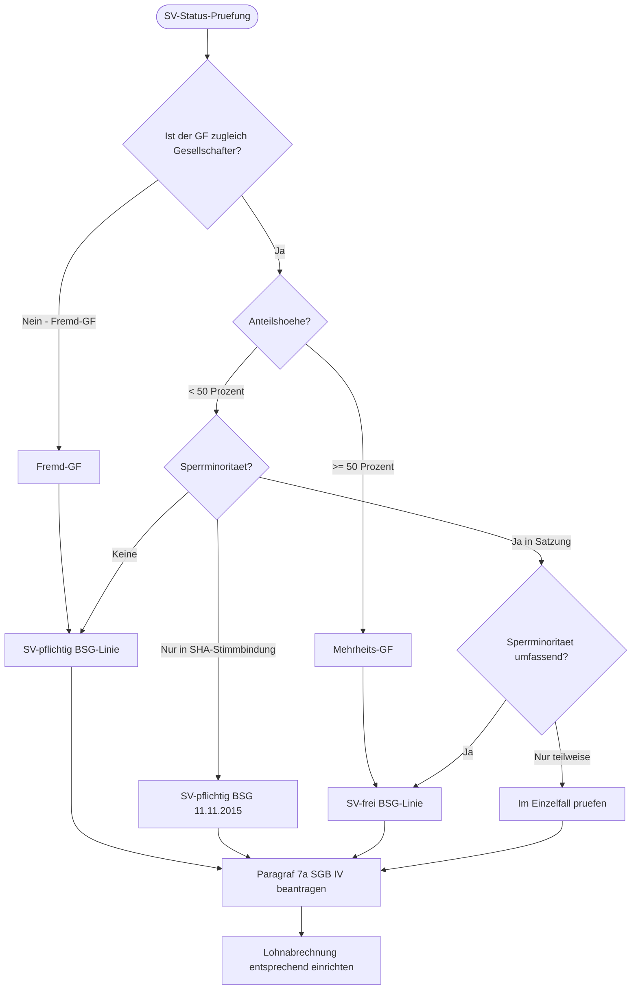

# Intake Decision Tree

## Arbeitsbereich

Entscheidungsbaum für GmbH-Gründung: Rechtsformwahl, Gründungsweg, Kapitalausstattung. Normen: GmbHG, AktG, PartGG, HGB. Prüfraster: Haftung, Steuer, Kapital, Gesellschafteranzahl. Output: Entscheidungsmatrix Rechtsformwahl. Abgrenzung: nicht detaillierte Vertragsmuster. Die Prüfung konzentriert sich auf dieses Prüffeld und trennt Rolle, Frist, Zuständigkeit, Beweislast und gewünschten Output.

## Arbeitsweg

- Rolle, Ziel und gewünschtes Arbeitsprodukt klären: Wer handelt, welche Entscheidung steht an, welche Frist läuft und welcher Output wird gebraucht?
- Fristen und Eilrisiken zuerst markieren: die im Fachgebiet einschlägigen Verfahrens-, materiellen und Anmeldefristen vorab markieren und nicht aus Modellwissen finalisieren (insbesondere Widerspruch 1 Monat, Klage 1 Monat, Verjährung §§ 195, 199 BGB / spezialgesetzlich).
- Tragende Normen verifizieren: DSGVO Art. 5, 6, 7, 9, 12-22, 25, 28, 30, 32, 33-34, 35, 51-58, 77-83, BDSG §§ 22-25, 26, 30 — Fundstellen über gesetze-im-internet.de, dejure.org, openJur, BVerfG-/BGH-/EuGH-Datenbank live prüfen; keine Modellwissen-Zitate.
- Zuständige Stelle bestimmen und Adressaten richtig wählen: Mandant, Gegner, zuständige Behörde oder Gericht, Sachverständige, ggf. EU-/internationale Stelle (siehe Skill-Detail).
- Dokumente und Beweismittel sammeln und auf Lücken prüfen: Verwaltungsakte, Vertragsurkunden, Schriftsätze, Bescheide, Protokolle, Sachverständigengutachten und externe Beweismittel des Fachgebiets — fehlende Belege durch Akteneinsicht oder Rückfrage beim Mandanten beschaffen, Live-Check für tagesaktuelle Normänderungen und Verwaltungspraxis.

## Spezialwissen

## Fachlicher Kern — Gesellschaftsrecht und Corporate Law
- **Problemfokus dieses Skills:** Bleibe beim konkreten Titel `Intake Decision Tree` und löse die dort angelegte Fachfrage; keine Flucht in allgemeines Routing, außer eine echte Frist oder Zuständigkeit ist unklar.
- **Normenradar:** GmbHG §§ 3, 5, 13, 15, 16, 30, 34, 35, 40, 43, 46, 47, 49 ff.; AktG §§ 76, 93, 111, 119, 130, 243 ff.; HGB §§ 105 ff., 161 ff.; MoPeG/GesRÄndG-Folgen; UmwG; FamFG/Registerrecht; GWB/Fusionskontrolle bei Transaktionen.
- **Verifizierte Anker:** BGH, Urteil vom 08.11.2022 - II ZR 91/21 (zutreffende Gesellschafterliste/Listenstreit); BGH, Beschluss vom 18.03.2025 - II ZB 11/24 (Registerordner/Gesellschafterliste, Prüfungsumfang); BGH, Urteil vom 11.12.2006 - II ZR 166/05 und Urteil vom 12.04.2016 - II ZR 275/14 (Treuepflicht, Zustimmungspflichten); BGH, Urteil vom 30.09.2025 - II ZR 154/23 (Drittvergleich/verdeckte Vermögenszuwendung, Organ-/Beschlusskontrolle).
- **Arbeitsmodus:** Erst Gesellschaftsform, Organ, Beschlussweg, Vertretung, Registerlage, wirtschaftliches Ziel und Minderheitenposition sortieren; dann Treuepflicht, Kapitalerhaltung, Haftung, Transaktions-Closing und Beweis-/Vollzugsrisiko prüfen.
- **Outputpflicht:** Beschluss-/Listenmatrix, Register-To-do, Board-/Beiratsvorlage, Closing-CP-Liste, Treuepflicht-Red-Team, Geschäftsführerhaftungsmemo oder Mandanten-Decision-Paper.
- **Fehlerbremse:** Tragende Normen/Entscheidungen live oder aus der Akte verifizieren; Rechtsprechung nur mit Gericht, Entscheidungsform, Datum, Aktenzeichen und frei prüfbarer Quelle. Keine BeckRS-, juris-, Kommentar- oder Aufsatz-Blindzitate aus Modellwissen.


## Kernsachverhalt

Der Gründer-Intake-Prozess ist das erste strukturierte Gespräch zwischen Mandant und Kanzlei. Zu diesem Zeitpunkt sind alle weichenstellenden Entscheidungen noch offen: Rechtsform, Kapitalstruktur, Gesellschafter-GF-Verhältnis, Investorenstruktur, Sozialversicherungsstatus. Fehlerhafte Weichenstellungen im Intake — falsche Rechtsform, fehlende Sperrminorität, nicht geplante Holding-Struktur — lassen sich später nur mit erheblichem Aufwand und steuerlichen Risiken korrigieren.

Dieser Skill stellt den grafischen Decision Tree für den Gründer-Intake-bereit: konditionale Logik als Mermaid-Diagramm, Pflichtfeld-Validierung, Trigger-Events für Skills und Dokumente, Fristen-Engine-Integration und Workflow-Engine-Hinweise für Implementierung in Bryter, Josef, Documate oder custom Node.js/React.

## Kaltstart-Rückfragen

1. **Mandats-Kontext:** Erstmaliges Intake oder Update eines bestehenden Mandats?
2. **Gründer-Profil:** Anzahl der Gründer, Identitätsdaten verfügbar?
3. **Kapital:** Eigenkapital verfügbar? Wie hoch?
4. **Investor-Roadmap:** Ist externer Investor in 12–24 Monaten geplant?
5. **GF-Rolle:** Soll ein Gründer Geschäftsführer werden? Anteilshöhe?
6. **Vorhandene Dokumente:** Liegt bereits ein Term Sheet, NDA oder LOI vor?
7. **Workflow-Engine:** In welcher Plattform soll der Decision Tree implementiert werden (Bryter, Josef, Documate, Custom)?
8. **Output-Format:** DOCX, PDF, XLSX, iCal/ICS oder JSON?

## Rechtlicher Rahmen

### Normtexte und Kernnormen

**§ 7a SGB IV — Statusfeststellungsverfahren**
> Die Einzugsstelle hat auf Antrag des Arbeitgebers oder der Arbeitnehmerin oder des Arbeitnehmers eine Entscheidung zu treffen, ob eine Beschäftigung vorliegt.

Das Statusfeststellungsverfahren bei der DRV Bund (Clearingstelle) ist das primäre Instrument zur verbindlichen Klärung des SV-Status eines Gesellschafter-GF. Es soll nach der BSG-Rechtsprechung frühzeitig — spätestens mit Aufnahme der GF-Tätigkeit — eingeleitet werden. Eine rückwirkende Beitragspflicht kann bis zu 4 Jahre zurückreichen (§ 25 SGB IV, Regelverjährung) oder bei vorsätzlicher Nichtanmeldung bis zu 30 Jahre (§ 25 Abs. 1 S. 2 SGB IV).

**§ 20 GwG — Transparenzregister (TraFinG)**
> Vereinigungen sind verpflichtet, die wirtschaftlich Berechtigten zu ermitteln, aktuell zu halten und an das Transparenzregister zu melden.

Frist: unverzüglich nach Eintragung der Gesellschaft im Handelsregister und unverzüglich bei jeder Änderung der Beteiligungsverhältnisse (2 Wochen). Bußgeld bei Verstoss: bis 1.000.000 EUR (§ 56 GwG).

**§ 192 SGB VII — Berufsgenossenschaft**
> Bei Aufnahme der unternehmerischen Tätigkeit muss die Anmeldung bei der zuständigen Berufsgenossenschaft innerhalb von 1 Woche erfolgen.

**§ 138 AO — Steuerliche Anzeigepflicht**
> Steuerpflichtige, die eine gewerbliche oder berufliche Tätigkeit aufnehmen, haben dies dem Finanzamt mitzuteilen (ELSTER-Fragebogen).

**§ 1365 BGB — Verfügungsbeschränkung bei Güterstand**
> Wenn der Gründer im gesetzlichen Güterstand (Zugewinngemeinschaft) lebt, bedarf die Verfügung über das gesamte Vermögen der Zustimmung des Ehegatten. Bei Einbringung des gesamten Vermögens in eine Gesellschaft: Prüfung des § 1365 BGB.

**§§ 1643, 1822 BGB — Genehmigung des Familiengerichts bei Minderjährigen**
> Bei Beteiligung minderjähriger Gesellschafter: Familiengericht muss der Eingehung der gesellschaftsrechtlichen Verbindlichkeiten zustimmen.

### Leitentscheidungen

| Gericht | Aktenzeichen | Fundstelle | Relevanz |
|---|---|---|---|
| Rechtsprechung live prüfen | Live-Verifikation erforderlich | - | keine Entscheidung aus Modellwissen zitieren; vor Ausgabe offizielle oder frei zugängliche Quelle mit Gericht, Datum, Aktenzeichen und Aussage protokollieren |

## Prüfschema: Intake-Knotenpunkte

| Schritt | Knotenpunkt | Prüfinhalt | Trigger / Output |
|---|---|---|---|
| 1 | Stammdaten-Knoten | Anzahl Gründer; Identität (Name, Geburtsdatum, Ausweis-Nummer); Familienstand (§ 1365 BGB); Minderjährigkeit (§§ 1643, 1822 BGB) | Validierung; Trigger: Familiengericht-Genehmigung bei Minderjährigen |
| 2 | Rechtsformwahl-Knoten | Kapital verfügbar, Investoren geplant, Haftungsrisiko, Freiberuf? | Trigger: gesellschaftsgruender-rechtsformwahl |
| 3 | Kapital-Knoten | < 25.000 EUR → UG; 25.000 EUR → GmbH; Sacheinlage → Differenzhaftungsprüfung (§ 9 GmbHG) | Validierung Stammkapital; Sachgründungsbericht |
| 4 | Class-Shares-Knoten | Investor in 12 Monaten? → Class-Shares sofort; Nein → später oder Genehmigtes Kapital vorsehen | Trigger: SHA-Modul / Satzungs-Modul |
| 5 | SHA-Modul | Vesting für Gründer? Stimmbindung? Liquidation Preference? | Trigger: gesellschaftsgruender-klauselkatalog-bilingual |
| 6 | SV-Status-Knoten | GF ist Gesellschafter < 50 %? Echte Sperrminorität in Satzung? | Trigger: Statusfeststellungsverfahren § 7a SGB IV; Warnung bei SHA-only-Stimmbindung |
| 7 | Notar-Knoten | DiRUG online oder physisch? Termin gebucht? Unterlagen vollständig? | Trigger: Notar-Paket-Generierung |
| 8 | Behörden-Knoten | Gewerbe, Finanzamt (ELSTER), IHK, BG, TraFinG | Trigger: Fristen-Engine; automatischer Behörden-Kalender |
| 9 | Compliance-Knoten | Erste-100-Tage-GF-Pflichten: § 315 HGB, § 325 HGB (erste Offenlegung), § 40 GmbHG (Gesellschafterliste), § 20 GwG (TraFinG) | Trigger: gesellschafts-compliance |
| 10 | Streit-Eskalations-Knoten | Streit zwischen Gründern? Beschluss angefochten? | Trigger: gesellschaftsgruender-gesellschafterstreit-eilantraege |

## Gesamt(Mermaid)


## Detail-Diagramm: Class-Shares-Modul


## Detail-Diagramm: SV-Status-Prüfung



## Detail-Diagramm: Streit-Eskalations-Pfad


## Pflichtfeld-Knotenpunkte (vollständig)

### Knoten 1 — Stammdaten

**Pflichtfelder:**
- Anzahl Gründer
- Identität: Name, Geburtsdatum, Anschrift, Personalausweis-Nummer (GwG-Identifizierung)
- Familienstand (§ 1365 BGB-Prüfung: Zustimmung des Ehegatten bei Verfügung über Gesamtvermögen)
- Minderjährigkeit (§§ 1643, 1822 BGB: Familiengericht-Genehmigung erforderlich)

**Validierung:**
- Personalausweis-Nummer syntaktisch korrekt
- Bei Minderjährigkeit: Trigger Familiengericht-Genehmigung
- GwG-Pflicht: Identifizierungsunterlagen (§ 10 GwG) vorhanden?

### Knoten 2 — Anteilsverteilung

**Pflichtfelder:**
- Stammkapital absolut (in EUR)
- Anteilshöhen pro Gründer (in EUR und %)
- Klassen-Festlegung (Common / A / B / C)

**Validierung:**
- Summe aller Anteile = 100 %
- Mindesthöhe pro Klasse
- Pflicht-Hinweis: Bei Investor-Roadmap → Class-Shares vorsehen
- 50/50-Split ohne Stichentscheid → Warnung Patt-Risiko

### Knoten 3 — Firma und IP

**Pflichtfelder:**
- Wunsch-Firma
- Sitz (Bundesland, Stadt)
- Geschäftsgegenstand (präzise, für HV-Beschluss tauglich)

**Validierungs-Trigger:**
- HR-Suche bundesweit (Namenskollision)
- IHK-Vorprüfung
- DPMA-/EUIPO-Markenrecherche
- Domain-Verfügbarkeit
- Bei Kollision: Alternativ-Vorschläge anbieten

### Knoten 4 — Geschäftsführung

**Pflichtfelder:**
- Anzahl GF
- Gesellschafter oder Fremd-GF?
- Anteilshöhe (falls Gesellschafter-GF) → SV-Status-Prüfung
- Anstellungsvertrag-Eckdaten: Grundgehalt, Tantieme, Urlaub, Wettbewerbsverbot

**Trigger:**
- SV-Status-Prüfung (Diagramm 3)
- Statusfeststellungsverfahren § 7a SGB IV
- GF-Anstellungsvertrag-Generierung

### Knoten 5 — SHA und Vesting

**Pflichtfelder bei Multi-Gründer (≥ 2):**
- Vesting-Periode (Standard: 48 Monate)
- Cliff (Standard: 12 Monate)
- Bad-Leaver-Definition (eigene Kündigung, Pflichtverletzung, Wettbewerbsverstoß)
- Good-Leaver-Definition (Tod, Erwerbsunfähigkeit, einvernehmliche Aufhebung)
- Drag/Tag-Schwellen (Standard: 75 % Drag; 50 % Tag)

**Warnungen:**
- Fehlendes Vesting bei Multi-Gründer → Bad-Leaver-Risiko
- Anti-Dilution Full Ratchet → aggressiv; nur bei sehr riskanten Investments

### Knoten 6 — Beirat (optional, empfohlen)

- Beirat ja/nein
- Anzahl Mitglieder (ungerade für Stichentscheid)
- Schlichtungs-Funktion (Voraussetzung für Schlichtungspflicht vor Klage)
- Vergütung (oft: Stundensatz oder jährliche Vergütung)

### Knoten 7 — Notar

**Trigger:**
- DiRUG online oder physisch?
- Notar-Termin-Buchung (Vorlauf 2–4 Wochen)
- Unterlagen-Liste generieren (Gesellschaftsvertrag, Personalausweise, Vollmachten bei ausländischen Beteiligten, Einzahlungsbeleg für Stammkapital)
- Stammkapital-Einzahlung vorbereiten (Konto eröffnen vor Beurkundung; Einzahlungsbeleg als Anlage zur HR-Anmeldung)

### Knoten 8 — Behörden-Pflichten nach HR-Eintragung

**Trigger automatisch:**
- Gewerbeanmeldung: unverzüglich (§ 14 GewO)
- ELSTER-Fragebogen: innerhalb 4 Wochen (§ 138 AO)
- IHK-Anmeldung
- Berufsgenossenschaft: 1 Woche (§ 192 SGB VII)
- TraFinG-Meldung (§ 20 GwG): unverzüglich nach HR-Eintragung

## Trigger-Events für Fristen-Engine

| Event | Frist | Aktion | Norm |
|---|---|---|---|
| HR-Eintragung | + sofort | TraFinG-Meldung | § 20 GwG |
| HR-Eintragung | + 1 Woche | BG-Anmeldung | § 192 SGB VII |
| HR-Eintragung | + 4 Wochen | ELSTER-Fragebogen | § 138 AO |
| GF-Aufnahme Tätigkeit | + sofort | Statusfeststellungsverfahren § 7a SGB IV | § 7a SGB IV |
| Geschäftsjahresende | + 3 Monate | Jahresabschluss aufstellen (§ 264 Abs. 1 HGB) | § 264 HGB |
| Jahresabschluss aufgestellt | + 9 Monate | Bundesanzeiger-Offenlegung (GmbH) | § 325 HGB |
| GV-Beschluss | + 1 Monat | Anfechtungsfrist | § 246 AktG analog |
| Krisenfrüherkennung-Trigger (§ 102 StaRUG) | + sofort | StaRUG-Prüfung oder § 49 Abs. 3 GmbHG-Gesellschafterversammlung | §§ 102, 49 StaRUG; § 49 Abs. 3 GmbHG |
| Insolvenzreife (§§ 17, 19 InsO) | + 3 Wochen | § 15a InsO-Antragspflicht | § 15a InsO |
| Gesellschafterwechsel | + sofort (HR) / + 2 Wochen (TraFinG) | Gesellschafterliste § 40 GmbHG + TraFinG-Meldung § 20 GwG | §§ 40 GmbHG, 20 GwG |

## Validierungsregeln

### Hartes Validierungsblock (Blocked-State)

| Validierung | Norm | Fehler |
|---|---|---|
| Stammkapital < Mindesthöhe (UG: 1 EUR; GmbH: 25.000 EUR) | § 5 Abs. 1, § 5a Abs. 1 GmbHG | Block: Gründung nicht möglich |
| Anteilssumme ≠ 100 % | § 5 GmbHG | Block: Kapitalstruktur inkonsistent |
| Pflichtfeld fehlt (Name, Geburtsdatum, Anschrift) | § 10 GwG; § 7 GmbHG | Block: HR-Anmeldung nicht möglich |
| Sacheinlage ohne Werthaltigkeitsnachweis | § 9 GmbHG | Block: Sachgründungsbericht erforderlich |
| Minderjähriger ohne Familiengericht-Genehmigung | §§ 1643, 1822 BGB | Block: Beurkundung unzulässig |

### Weiches Validierungswarnung (Warning-State)

| Warnung | Grund | Empfehlung |
|---|---|---|
| 50/50-Anteilsverteilung ohne Stichentscheid | Patt-Risiko bei jeder streitigen Abstimmung | Stichentscheid durch Beirat oder numerische Asymmetrie |
| Vesting fehlt bei Multi-Gründer | Bad-Leaver ohne Schutz: Gründer kann sofort aussteigen und Anteile behalten | Vesting-Klausel SHA dringend |
| Bezugsrechtsausschluss ohne sachliche Begründung | Anfechtungsrisiko (BGH Kali+Salz) | Sachliche Begründung dokumentieren |
| Minderheits-GF ohne Sperrminorität in Satzung | SV-Pflicht nach BSG-Linie | Sperrminorität in Satzung verankern; SHA-Stimmbindung allein reicht nicht |
| Wettbewerbsverbot ohne Karenzentschädigung | § 74c HGB analog; sittenwidrig wenn > 0 EUR ohne Karenz | Karenzentschädigung 50 % der Vergütung vereinbaren |
| Marken-Kollision erkannt | DPMA-Suche positiv | Alternativname vorschlagen; Abmahnungsrisiko |

## Workflow-Engine-Implementierung

### Empfohlene Plattformen

| Plattform | Eignung | Besonderheit |
|---|---|---|
| Bryter (https://bryter.com) | No-Code Legal Workflow; Kanzlei-Standard | Gut für komplexe Conditional Logic; Dokumenten-Ausgabe |
| Josef (https://www.josef.legal) | Document Automation; KMU-Kanzleien | Einfach für Dokumentengenerierung; begrenzte Workflow-Logik |
| Documate (https://www.documate.org) | Doc-Assembly für Legal | Fokus auf Dokumentengenerierung; gut mit DOCX-Vorlagen |
| Neota Logic | Enterprise-Workflow; große Kanzleien | Teuer; mächtig für komplexe Regelwerke |
| Custom Node.js + JSON Schema + React Hook Form | Maximale Flexibilität | Entwicklungsaufwand ca. 80–200 Stunden |

### Architektur

```
┌──────────────────────────────────────────┐
│ Frontend (React Hook Form / Bryter UI) │
│ Kaskadierende Fragen, JSON Schema │
└───────────────────┬──────────────────────┘
 │
┌───────────────────▼──────────────────────┐
│ Business-Logic-Engine │
│ Conditional Logic, Validierung, │
│ Trigger-Events, Fristen │
└───────────────────┬──────────────────────┘
 │
 ┌─────────────┼─────────────┐
 │ │ │
┌─────▼───┐ ┌─────▼────┐ ┌────▼──────┐
│ DOC │ │ Fristen- │ │ Notar- │
│ ASM │ │ Engine │ │ Paket- │
│ DOCX │ │ iCal / │ │ ZIP- │
│ PDF │ │ Outlook │ │ Export │
└─────────┘ └──────────┘ └───────────┘
```

### Output-Formate

| Format | Zweck | Norm / Empfänger |
|---|---|---|
| DOCX | Satzung, SHA, GF-Vertrag, Beiratsordnung (Entwurf) | Anwalt / Mandant zur Bearbeitung |
| PDF | Endversion nach Beurkundung | Archivierung; Behörden |
| XLSX | Cap Table, Fristen-Liste, Behörden-Checkliste | Mandant; Steuerberater |
| iCal / ICS | Fristen-Kalender | Outlook / Apple Calendar; automatische Erinnerungen |
| JSON | Daten-Export | Buchhaltungs-Software; CRM |
| ZIP | Notar-Paket | Notar; alle Urkunden komprimiert |

## Beispielhafter Knoten-Inhalt JSON

```json
{
 "node_id": "intake_class_shares",
 "title": "Class-Shares-Festlegung",
 "question": "Sollen Anteilsklassen schon bei Gruendung eingefuehrt werden?",
 "type": "single-choice",
 "options": [
 {
 "id": "only_common",
 "label": "Nur Common Shares",
 "next": "intake_vesting",
 "trigger_skill": "gesellschaftsgruender-gesellschaftsvertrag-gmbh",
 "warning_if": [
 {
 "condition": "investor_planned_within_12_months == true",
 "message": "Bei absehbarem Investor empfohlen, schon jetzt Class-Shares oder genehmigtes Kapital fuer Class B vorzusehen"
 }
 ]
 },
 {
 "id": "common_and_b",
 "label": "Common + Class B (Vorbereitung Investor)",
 "next": "intake_b_share_terms",
 "trigger_skill": "gesellschaftsgruender-share-classes-a-b-c"
 },
 {
 "id": "multi_class",
 "label": "Multi-Class (Common + A + B + C)",
 "next": "intake_multi_class_governance",
 "trigger_skill": "gesellschaftsgruender-share-classes-a-b-c",
 "warning": "Multi-Class-Strukturen sind komplex und teuer beim Notar; nur bei klarer Investoren-Roadmap empfohlen"
 }
 ]
}
```

## Reporting und Audit-Trail

### Audit-Trail

Jede Eingabe und jede Entscheidung wird protokolliert mit:
- Zeitstempel (ISO 8601)
- Benutzer
- Eingabe-Wert
- Validierungs-Status (OK / Warning / Block)
- Triggered Skills / Dokumente

### Automatisches Reporting am Intake-Ende

- **Datenblatt Gründung**: alle Eckdaten in strukturierter Form
- **Cap Table Initial**: Anteilsverteilung, Klassen, Ausgabepreise
- **Pflichten-Checkliste**: mit Fristen (iCal-Export)
- **Stoppschild-Liste**: was zwingend Anwalt / Notar / Steuerberater
- **Notar-Paket**: vorbereitet für Notartermin (ZIP)
- **Behörden-Pflichten-Kalender**: automatisch als ICS-Datei

## Streitwert und Kosten

| Workflow-Element | Kostenhinweis |
|---|---|
| Bryter-Lizenz | ca. 500–2.000 EUR/Monat je nach Nutzung |
| Juristische Übersetzung (bei bilingualen Dokumenten) | 500–4.000 EUR je nach Umfang |
| Custom-Entwicklung (Node.js + React) | 80–200 Stunden × Entwickler-Stundensatz |
| Notar-Gebühren GmbH-Gründung (25.000 EUR Stammkapital) | ca. 700–1.500 EUR |
| Anwaltliche Begleitung kompletter Gründungs-| ca. 3.000–10.000 EUR (Kanzlei-abhängig) |

## Strategische Empfehlung

| Situation | Empfehlung |
|---|---|
| Startup mit Investor-Roadmap | Vollständiger Intake-mit Class-Shares, SHA, Vesting; Notar-Paket parallel vorbereiten |
| Solo-Gründer ohne Investorenpläne | Vereinfachter Workflow: Rechtsformwahl + GmbH/UG-Gründung + Behörden-Checkliste |
| Kanzlei will digitalisieren | Bryter oder Josef als No-Code-Einstieg; Custom-Entwicklung für maximale Kontrolle |
| Mehrere Gründer, Streitpotenzial absehbar | Vollständige SHA mit Vesting, Drag/Tag, Schiedsklausel; Beirat mit Schlichtungsfunktion |

## Anschluss-Skills

- `gesellschaftsgruender-gruender-intake` — Intake-Fragen im Detail
- `gesellschaftsgruender-cap-table` — Cap-Table-Generierung
- `gesellschaftsgruender-klauselkatalog-bilingual` — Klauseln im Volltext
- `gesellschaftsgruender-rechtsformwahl` — Rechtsformempfehlung aus Intake-Daten
- `gesellschaftsgruender-gesellschafterstreit-eilantraege` — Streit-Eskalationspfad

## Quellen und Zitierweise

- § 7a SGB IV (Statusfeststellungsverfahren)
- § 25 SGB IV (Verjährung SV-Beiträge: 4 Jahre / 30 Jahre)
- § 20 GwG (Transparenzregister; Meldefrist 2 Wochen)
- § 192 SGB VII (BG-Anmeldung 1 Woche)
- § 138 AO (Steuerliche Anzeige)
- §§ 1365, 1643, 1822 BGB (Ehegattenzustimmung; Minderjährige)
- § 15a InsO (Insolvenzantragspflicht 3 Wochen)

Zitierweise nach `../../references/zitierweise.md`.

Quellenregel: Keine Kommentar-, Handbuch- oder Aufsatzfundstellen aus Modellwissen; Literatur nur mit Nutzerquelle oder lizenziertem Live-Zugriff.
- Rechtsprechung: keine Entscheidung aus Modellwissen zitieren; vor Ausgabe über offizielle oder frei zugängliche Quelle mit Gericht, Entscheidungsform, Datum, Aktenzeichen und tragender Aussage verifizieren.

## Aktuelle Rechtsprechung (Ergaenzung)

- Rechtsprechung: keine Entscheidung aus Modellwissen zitieren; vor Ausgabe über offizielle oder frei zugängliche Quelle mit Gericht, Entscheidungsform, Datum, Aktenzeichen und tragender Aussage verifizieren.

## Output-Template: Intake-Ergebnis-Zusammenfassung

**Adressat:** Mandant / Kanzleiakte — Tonfall verstaendlich-erklaerend

```
INTAKE-ERGEBNIS — [FIRMA] (geplant)
Datum: [DATUM] | Bearbeiter: [NAME]

EMPFOHLENE RECHTSFORM: [GmbH / UG / GmbH & Co. KG]
Begruendung: [KURZE BEGRUENDUNG AUS DECISION TREE]

GESELLSCHAFTER:
 [NAME 1]: [%] Anteile | Sperrminoritaet: [Ja/Nein] | GF: [Ja/Nein]
 [NAME 2]: [%] Anteile | Sperrminoritaet: [Ja/Nein] | GF: [Ja/Nein]

SV-STATUS GF(s):
 [NAME]: [SV-pflichtig / SV-frei (Mehrheit)] | Statusfeststellung empfohlen: [Ja/Nein]

NAECHSTE SCHRITTE:
 [ ] Firmenname pruefen (IHK-Vorpruefung)
 [ ] Notar-Termin vereinbaren (Vorlauf: 2-4 Wochen)
 [ ] Stammkapital einzahlen (mind. 12.500 EUR)
 [ ] Transparenzregister-Anmeldung (nach HR-Eintragung)
 [ ] Berufsgenossenschaft (1 Woche nach Geschaeftsbeginn)
 [ ] Finanzamt (ELSTER-Fragebogen; § 138 AO)
 [ ] SV-Statusfeststellung beantragen (DRV Bund)

FRISTEN-EXPORT: [iCal / Outlook generiert: JA / NEIN]
NOTAR-PAKET: [ZIP erstellt: JA / NEIN]
```
